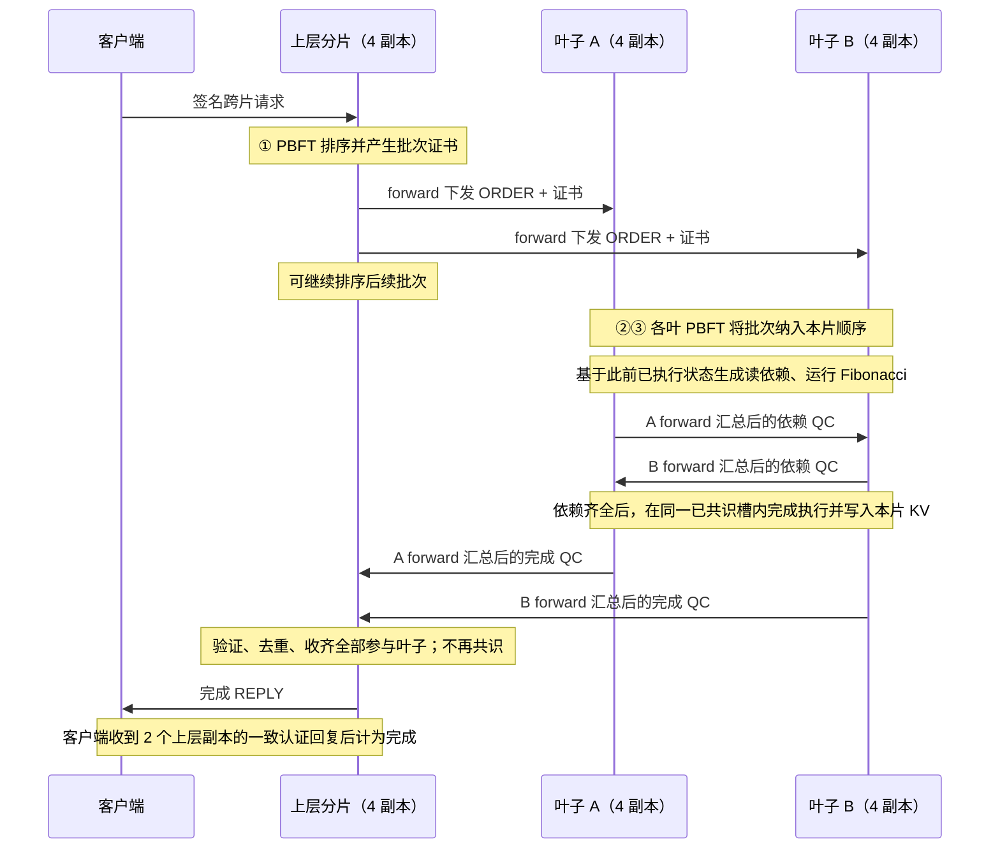

# 跨片协议修订：上层排序，下层提交，收齐回复即结束

日期：2026-10-02。依据本轮用户更正，以及 `Arbor.pdf` 第 IV 章执行服务、第 V-A 节四阶段流程和图 3。

**状态：代码已按本文替换旧 6 次分片 PBFT 路径；最终新流程 85 项自动检查通过，并完成三轮独立集群性能复测。** 当前设计见 [CURRENT_IMPLEMENTATION_DESIGN.md](CURRENT_IMPLEMENTATION_DESIGN.md)，本轮证据见下文。本文不沿用旧流程的通过结论或 TPS。

## 1. 更正的核心

上层分片负责对跨片批次排序，并把排序结果及证书发给相关叶子。叶子把收到的批次纳入本片顺序，执行交易，收齐所需远端依赖后提交本片状态，再向上层回复完成证明。

上层验证并收齐**该批次所有参与叶子**的完成证明后，该批次协议结束，可以直接回复客户端。上层收到这些证明不再发起 PBFT，也不再生成或下发新的全局提交决定。

此前实现额外加入了 `READY → 上层 DECISION PBFT → 下层 FINALIZE PBFT`，增加了共识与往返，不符合本轮明确的协议。修订删除整个协调提交决定阶段。

对于当前两个叶子的完整路径，正常情况共识次数为：

```text
上层排序 PBFT：1 次
叶子 A 排序 PBFT：1 次
叶子 B 排序 PBFT：1 次
合计：3 次分片 PBFT
```

两个叶子的共识可并行。依赖证明和完成证明的签名聚合不是额外 PBFT：没有新增 PREPREPARE/PREPARE/COMMIT 轮次，也不新增共识槽。

## 2. 修订后的正常消息路径



源分片继续只有当前 forward 跨片发送；依赖票和完成票先在本片汇总为三个不同副本的签名证明。目标片仍由四个副本接收，各自验真；只有其当前主节点提出本片排序共识。

协议不需要上层在收齐完成证明后再向叶子广播 DONE 作为业务阶段。叶子提交不等待上层回执，客户端完成也不依赖额外 DONE 往返。停止重发、证明补取属于传输管理，不能再变成提交前置条件。

## 3. 上层分片职责

上层保留：客户端请求和交易去重、参与集合组批、批次顺序、排序 PBFT、订单证书下发、在途窗口，以及完成证据验证与客户端回复。

收到叶子完成消息后只做：

1. 验证发送者、run、批次身份及签名证明。
2. 确认该叶子属于批次参与集合，并且证明对应正确的上层订单。
3. 按叶子 ID 保存一份有效完成证明，重复消息不重复计数。
4. 核对各叶子对应同一批次和同一执行上下文。
5. 参与集合全部到齐后，缓存结果、释放在途窗口并回复客户端。

上层只排序交易，不再次执行叶子程序。它也不因不同副本收到完成证明的时间不同而发起新共识：完成条件由已经认证的叶子提交事实决定。

完成证明集合和派生结果属于非共识缓存，不把“此时收到哪些 ACK、哪些三签子集”写入 PBFT 状态摘要。否则各副本的网络到达顺序会影响检查点。上层的共识状态只记录确定性的订单元数据，完成缓存通过叶子证明恢复。

## 4. 下层分片职责：一次共识，同一槽执行完成

叶子收到上层排序证书后，验证证书并通过一次本片 PBFT 将批次放入本片顺序。随后执行可以因为远端依赖而暂时等待，但**等待与最终写入仍属于这一共识槽的执行**，不再另提 FINALIZE。

需要区分三个位置：

| 位置 | 含义 |
|---|---|
| 已收到上层订单 | 本片已验证跨片排序来源 |
| 本片 PBFT 已提交 | 该批次本地顺序已固定，可进入确定性执行 |
| 本片执行已完成 | 远端依赖已齐，KV、去重结果和应用序号可一次性更新 |

实现建议：

- PBFT commit 后保留当前槽证书，在临时执行上下文中保存本地读快照、逐笔记录和 Fibonacci 结果。
- 尚未取得所需依赖时，不推进该槽的 `applied`，不生成该序号的执行后检查点，不把临时准备状态作为正式 KV。
- 每个非重复交易、每个正常执行副本只运行一次 Fibonacci；重传依赖不重复计算。
- 本片和远片依赖 QC 齐全后，按已确定顺序更新 working state，然后一次性更新正式 KV、交易去重状态、应用序号、链摘要和提交日志。
- 此后生成本片完成票，forward 收齐三个一致签名后回上层。

旧 `applyReady()` 在 ORDER 后就推进应用序号；本轮将这一边界改为同槽执行完成后推进。不能只删 FINALIZE 提案，再在异步消息处理函数里直接写 KV，否则同一 seq 的状态会随着消息到达变化，检查点和追赶重放可能失配。临时 `stagedRecords` 不入正式 state，提交日志使用 `execution_witness={batch_key, proofs}` 保存双方认证记录。

这一修订先保留叶子顺序执行机制。是否按 key 并行等待和执行属于后续调度优化，不通过额外上层提交共识解决。

## 5. 依赖与完成证据

### 5.1 保留远端读依赖

现有模拟交易的本地写值依赖远片旧值，因此仍需叶子间交换认证读写记录。删掉上层二次共识，不等于删掉交易本身所需的跨片数据。

沿用现有确定性程序：

```text
newA = inputA + oldB + fib
newB = inputB + oldA + fib
```

同 key 的批内交易顺序复用 working state；每个本地 key 的初始快照只交换一次。若以后专门实验无需远端读值的独立执行负载，应作为不同负载类型定义，不能悄悄改变当前交易语义。

### 5.2 完成票替换旧 decision 绑定

原 ACK 绑定上层 `decision_digest`，修订后不存在这个决定。完成票应绑定：

| 字段 | 用途 |
|---|---|
| `batch_key` | 标识上层排序批次 |
| `order_digest` | 绑定原始订单内容 |
| `execution_digest` | 绑定规范化的双方依赖/执行上下文 |
| `result_digest` | 绑定本叶子的执行结果 |
| owner、run、signer | 身份和运行隔离 |

执行上下文摘要按叶子 ID 排序，依据确定性记录生成，排除可变的签名子集和传输外层字段。不同合法三签子集不能产生不同的业务结果身份。

上层验证每叶三个不同 signer 的完成票，核对双方 order/execution digest 一致。各叶 result digest 对应本片写入，允许不同；不能要求两片 KV 摘要相同。

## 6. 去重、顺序和流水线

继续保留三个独立层次：

- 请求/交易去重：相同请求重试、完成别名、pending 重叠等待、ID 内容冲突。
- PBFT 去重：主节点唯一提案，同槽和同 signer 投票不重复计数。
- 证据去重：同批依赖和完成证明按 origin/digest 去重，不因重传重新执行。

客户端成功的时刻仍是上层收齐全部相关叶子完成证明并返回足够一致回复。仅有上层排序证书不能计为执行完成。

上层排序后可以继续处理后续批次，叶子在执行前一批时不阻塞上层每个后续排序槽。有限在途窗口可以继续作为工程背压，但每个完成回复不会插入 DECISION 槽。批次 order index 与 PBFT seq 可以保留分开表示，避免把身份约定与新协议强耦合。

## 7. 重发、forward 接替与追赶

### 7.1 提交后仍须能补取依赖

较快叶子完成本地执行后，要保留该批次的本地依赖记录/QC 或执行 witness。较慢叶子可能尚未收到这些数据；不能因为较快叶子已经给上层回 ACK，就清空证明并停止提供。

本轮用 `CST_DEPENDENCY_QUERY={target,batch_keys}` / `CST_DEPENDENCY_PROOFS={target,witnesses}` 补取依赖，等待时约每 2 秒查询和重发准备票/QC。完成 QC 每个 forward view 正常主动发送一次，不无限定时广播所有已完成批次；叶子本片票/QC 缺失或根重发 ORDER 时可以补发。根片内部结果 QUERY 补取同伴已有的 ORDER 证书和 ACK QC。正常协议在上层收齐 ACK 时结束；之后如有丢包、迟到或副本追赶，补取旧证明属于恢复，不构成新业务阶段，也不增加 DONE 回执。

### 7.2 状态同步必须能重演执行

稳定检查点之前的 KV 可以依据认证快照安装。检查点之后的叶子 ORDER 证书只证明顺序，不包含远片读快照，所以 SYNC 还要附带或补取执行 witness。根据订单和依赖证明重演时，不能另行修改交易顺序或重复计数。

SYNC 可以先传发送方已 committed、尚未 applied 的槽证书，接收者凭它固定原顺序、进入 stage/wait；没有有效 witness 时不推进 seq、KV 或 journal。SYNC_REQUEST 的响应不能仅因请求者 after 不低于发送方 applied 就吞掉这类未执行提交证据。NEW_VIEW 安装后，持有者还分享一次本地已知未执行 commit 证书，补足所选三份 VIEW_CHANGE 可能遗漏的证明，不发起新投票。

SYNC 后缀的 `execution_witnesses=[{seq,witness}, ...]` 按叶子本地 seq 关联，proofs 按 leaf ID 排序。上层业务 state 的 `cst_orders[key]` 记录 `{order_digest, order_index, requests, duplicates}`；叶子 `cst_finalized[key]` 记录 `{order_digest, execution_digest, result_digest}`。上层完成缓存恢复通过片内 `CST_RESULT_QUERY`/`CST_RESULT_PROOFS` 取得原始订单和叶子完成 QC，不再依赖 `cst_decisions`。派生结果不因恢复缓存再触发 PBFT。

完成结果按数值 order index 补取；待补本片 ACK QC 使用活动集合，健康根已完成全部订单时跳过历史查询扫描。以上优化不改变业务状态和共识阶段。

### 7.3 区分共识等待和执行等待

PBFT 尚未 commit 时，沿用共识超时和视图切换；已 commit 但等待远端依赖时，执行重发/查询，不能仅因 `seq > applied` 就认为 PBFT 没有进展而反复换 view。forward 静默离线的接替仍保留；持续发心跳却遗漏数据的检测需要另行实现，不能把本次简化视为已经解决。

当前 view 的同槽已签 PREPARE/COMMIT 在执行等待期间仍限频重发，帮助缺证书副本；本地 commit 后把完整提交证明保留给 VIEW_CHANGE，NEW_VIEW 独立验证它与恢复值一致后导入原证书，已有证书的原槽无需再次签票。forward 追赶后缺历史依赖档案时，先在本片广播 QUERY，由备份本片应答，再由 forward 转发远片。根混合批的 duplicate 旧项缺原完成缓存时，也先补取原批证据再复制原结果，不从当前批重新派生旧结果。

## 8. 本轮删除与改造的代码路径

| 当前路径 | 修订 |
|---|---|
| `CST_READY`、`readyVotes`、`readySent` | 删除 READY 回上层阶段 |
| `validReady`、`validDecision`、`validDecisionCertificate` | 删除上层决定验证，改为直接依赖/完成证明验证 |
| 根 `propose()` 中 `cst_decisions` | 删除第二轮上层 PBFT |
| `CST_DECISION`、`forwardDecision`、`decisionCerts` | 删除决定下发与重发 |
| 叶 `propose()` 中 `cst_finalizations` | 删除第二轮叶子 PBFT |
| `stageCst`、`finalizeCst`、`applyReady` | 改为一个已提交槽的临时等待与一次性执行 |
| `maybeReady` | 改为叶子在依赖齐全后完成当前槽执行 |
| `validAckProof`、`maybeCompleteBatch` | 基于 ORDER/execution digest 和参与集合直接结束 |
| `sendDone` / `ackConfirmed` | 删除作为协议阶段的 DONE；用证明档案与查询处理重传 |
| SYNC、完成结果查询、重试和状态统计 | 不再依赖上层 decision；补执行 witness |
| 阶段测试与详细设计 | 从 6 次改为 3 次正常分片 PBFT，删除旧决定字段的期待值 |

保留长连接、延迟队列、签名、forward 汇总、组批、共识前去重、原生客户端计时及性能脚本隔离运行。

## 9. 本轮实现的验收条件

1. 一批全新双叶跨片交易，根增加一个 ORDER 槽；两叶各增加一个执行完成槽，无其他新业务槽。
2. 日志不出现 READY/DECISION/FINALIZE 的旧协议阶段；上层收到叶子完成 QC 后不新增共识提案。
3. 上层尚未收齐时客户端保持等待；收齐后直接完成，不等额外上层决定或 DONE。
4. 重复请求、重复 QC 和重复完成票不增加执行量与共识槽。
5. 同 key 连续交易仍得到与原确定性公式一致的结果；四副本最终状态一致。
6. 延迟或暂时断开一叶的依赖链路，恢复后可补取快叶已经提交批次的依赖数据。
7. 检查点前后追赶、forward 离线接替、完成缓存恢复均通过；不会因为执行等待反复换 view。
8. 保持原负载、配置和 seed，使用 benchmark 多轮对照，测量改动效果，不预先承诺 TPS 倍数。

## 10. 本轮最终验证记录

2026-10-02 最终源码 `make test` 退出码 0，共 85 项通过：网络 5、clean 18、第一阶段 14、第二阶段 A 1、第二阶段 B 5、工程 19、benchmark 23。日志为 `test-results/benchmark-20261002-205157-2422a358/validation-make-test.log`。

性能复测命令：

```bash
python3 scripts/benchmark.py --mode cross --count 4000 --rates 1000 --repeat 3 --seed 42 --cross-batch 8
```

本机 macOS 15.6、arm64、8 核和 `config/two_layer.json` 下，三轮均 4000 笔/500 请求完成、全副本收敛、网络失败为 0。TPS 为 619.41/625.81/632.35，中位数 625.81；平均延时、p95、p99 的轮次中位数分别为 1.301094、2.313776、2.396804 秒。报告为 `test-results/benchmark-20261002-205157-2422a358/summary.json` 和 `summary.csv`，详情见 [BENCHMARK.md](BENCHMARK.md)。旧 258.34 TPS 单轮不是正式多轮基线，不据此宣称固定提升倍数；`make clean` 会删除报告，长期保存需另存仓库外。

## 11. 完成口径

本修订遵循用户定义：相关叶子全部提交、上层收齐其有效回复，就结束该批次。不同叶子的物理写入时刻仍可能不同；本次不会额外加入跨片统一可见性屏障、全局 commit 决定或 abort 协议。
