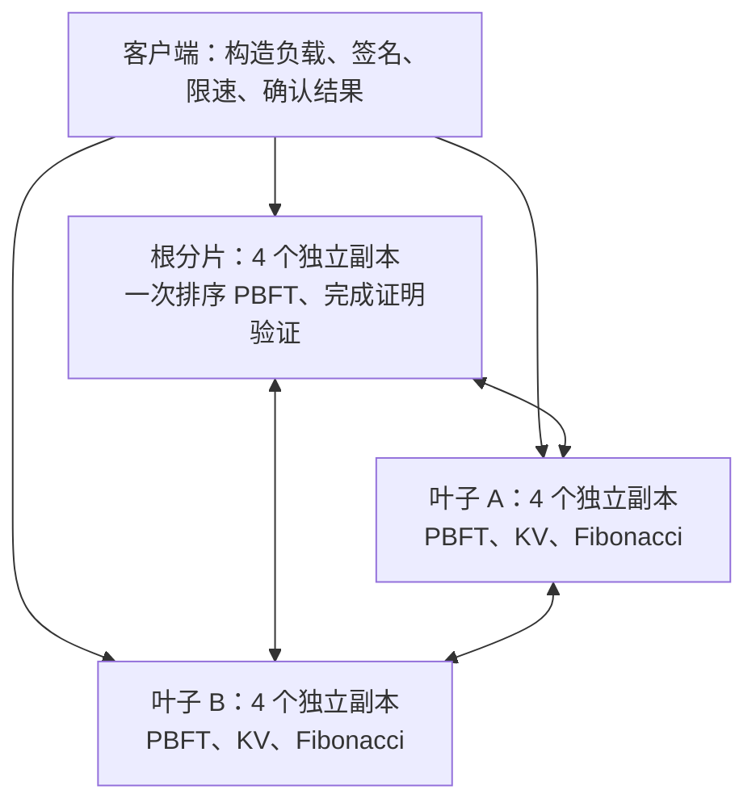
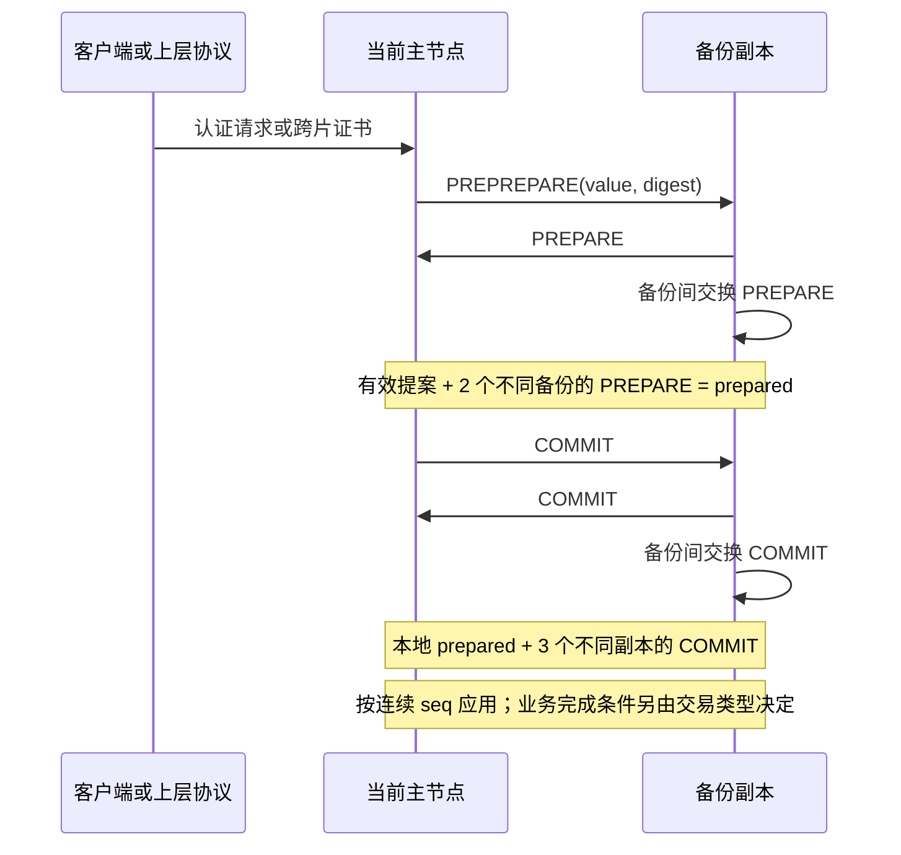
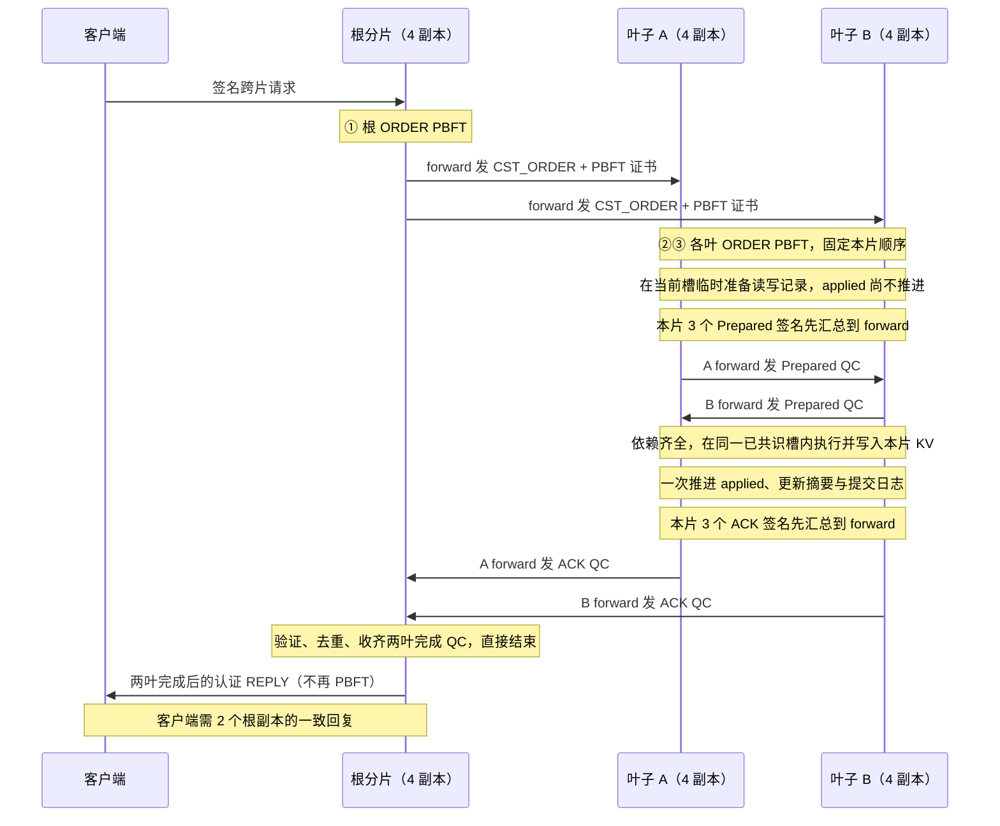

# Arbor 仿真系统当前实现详细设计（审阅稿）

核对日期：2026-10-02。本文描述当前仓库的实际实现，主要依据 `source/main.cpp`、`source/network.h`、`scripts/cluster.py`、`scripts/benchmark.py` 与自动测试。本文中的“已实现”表示代码中存在相应路径；测试覆盖范围另见第 16 节，不表示所有故障组合均已验证。

> **本轮协议更正：** 上层一次 PBFT 排序，两叶各一次 PBFT 将订单纳入本片顺序；叶子在同一已共识槽内等待依赖、执行并写入，上层收齐双方完成证明后直接回复。正常共 3 次分片 PBFT，删除 READY、上层 DECISION、叶子 FINALIZE 和 DONE 阶段。改造依据见 [CROSS_SHARD_PROTOCOL_REVISION.md](CROSS_SHARD_PROTOCOL_REVISION.md)。本次改造的测试和性能以本轮实际报告为准，旧路径结果不作为新路径验证证据。

本文供审阅协议和工程选择使用。它没有把后续计划写成当前能力，也不代表 Arbor 论文所有机制已经完成复现。第一阶段与第二阶段文档记录了演进过程；判断当前行为时，应以本文和当前源码为准。

## 1. 设计目标与当前完成范围

系统使用本机多进程仿真分片部署和链路延迟，同时实际运行副本间消息交换、签名验证、PBFT 投票和确定性执行。这样可以调整拓扑、网络条件和执行开销，而共识成本不会被一个固定等待时间替代。

| 需求 | 当前实现 | 边界 |
|---|---|---|
| 手动配置分片数量、拓扑 | JSON 定义树，校验并计算最低共同祖先 LCA；支持非连续分片 ID | 配置在一次运行内固定 |
| 每片 4 节点 PBFT | 4 个独立 C++ 进程，各有私钥、状态和投票记录 | 固定 `n=4, f=1`，不能仅修改配置扩展为任意副本数 |
| 启停与拓扑打印 | 一键启动、停止、状态查询、拓扑打印与运行目录隔离 | 当前所有节点部署在同一台机器 |
| 片内交易执行 | PBFT 提交后，逐笔运行 Fibonacci 并更新本片 KV | 确定性模拟程序，未接入 EVM/FISCO |
| 跨片完整提交 | 一个根协调片、两个直属叶子：排序、依赖交换、同槽执行与完成确认 | 多层和更多参与叶子的完整执行尚未实现；其他拓扑的跨片请求只排序，返回 `ordered_only` |
| forward 汇总后跨片发送 | 本片当前主节点兼任 forward；本片签名票先汇总成 QC，再出片 | 源片单 forward 发给目标片全部 4 副本，当前不是只发目标 forward |
| 去重 | 请求、交易、PBFT 投票、跨片证书分别去重 | 混合新旧交易的原签名请求可能再次进入批次，旧项跳过执行 |
| 批处理 | 多个兼容客户端请求合成一个跨片排序批次；读快照按唯一 key 复用 | 按参与分片集合组批；尚未按精确读写集分类或做冲突图并行调度 |
| 单独配置跨片延迟 | 每个分片对配置对称的单向附加延迟 | 尚未模拟带宽、抖动和随机丢包 |
| 性能报告 | 客户端唯一完成 TPS、秒延时；自动多轮测试及严格基线比较 | 当前主要是有限负载的整轮结果，尚无独立预热和稳态统计窗口 |

**本轮已确定的协议选择：** 每个跨片批次正常总共经过 **3 次分片 PBFT**；叶子只在同一个已提交槽内等待依赖和完成执行；上层只验真、去重、收齐完成证明，不新增共识。仍须审阅的工程边界包括叶子整片等待、forward 与 PBFT 主节点绑定、缺少跨片 abort，以及心跳不能识别“仍发心跳却扣留跨片数据”的 forward。

## 2. 模块、进程与线程

### 2.1 模块划分

| 模块 | 职责 |
|---|---|
| [`source/common.h`](../source/common.h) | JSON、SHA-256、Ed25519、单调时钟、文件输出 |
| [`source/network.h`](../source/network.h) | 非阻塞 TCP、长连接复用、长度前缀帧、定时发送队列、发送缓存和网络指标 |
| [`source/main.cpp`](../source/main.cpp) | 分片成员、PBFT、检查点、视图切换、状态追赶、跨片状态机、执行器、原生客户端 |
| [`scripts/cluster.py`](../scripts/cluster.py) | 配置校验、拓扑/LCA、密钥与运行目录生成、进程管理、随机负载、探测 |
| [`scripts/benchmark.py`](../scripts/benchmark.py) | 独立集群性能测试、排空和一致性检查、报告、基线比较 |
| [`config/`](../config/README.md) | 当前可运行 JSON 配置和旧格式参考配置 |
| [`tests/`](../tests/) | 真实进程集成测试、网络专项测试、统计逻辑检查 |

### 2.2 实际运行结构



每个副本进程包含两个主要线程：

1. **主线程**：处理 inbox、验证签名和证书、维护 PBFT/跨片状态、执行 Fibonacci、更新 KV、处理超时并输出状态。
2. **网络线程**：用 `poll` 管理监听 socket、唤醒管道、定时任务及所有非阻塞连接；完整解析 JSON 后放入 inbox。

主线程每轮最多处理 256 条 inbox 消息，再检查提案、超时、重试及状态输出，最后休眠 1 ms。执行和验证没有独立线程池。因此真实 CPU 开销会影响协议进展，4 个副本之间也会竞争同一台机器资源。

拓扑树用于确定片内/跨片目标和 LCA，**不限制 TCP 必须沿树逐跳转发**。叶子之间可以直接通信；延迟按实际源片与目标片查表，不能把沿父节点路径的延迟自动相加。

## 3. 配置与运行目录

### 3.1 配置入口

编辑配置统一放在 `config/`。当前启动器读取 `single_shard.json`、`two_layer.json`、`three_layer.json` 等 JSON 文件。`accessControlList`、`networkConfig`、`shardsTopology`、`workloadProfile`、`topShardId` 是旧格式参考，不被新启动器直接读取。

分片目录和节点日志属于运行产物，不放入 `config/`。一次运行生成独立 run ID、密钥、解析后的配置、manifest 和节点目录；这些快照用于记录该次实验实际输入。默认运行由 `runtime/latest` 指向，性能脚本使用独立目录，不改动该指针。

`make clean` 先停止仓库 `runtime/`、`test-results/` 内登记的节点，再删除编译产物、运行/测试记录、Python 缓存和顶层旧分片日志，保留源码与编辑配置。活动负载/性能/测试脚本会阻止清理；仓库外自定义输出不自动删除。`runtime/.lifecycle.lock` 保留，清理与启动复用同一把锁。

### 3.2 主要参数

| 参数 | 通用默认值 | 当前 `two_layer.json` | 含义 |
|---|---:|---:|---|
| `replicas_per_shard` | 4 | 4 | 固定副本数 |
| `host` | `127.0.0.1` | `127.0.0.1` | 本机可绑定的 IPv4 地址 |
| `base_port` | 19000 | 19000 | 按分片 ID 排序后，为各副本分配连续端口 |
| `consensus.batch_size` | 32 | 1000 | 普通 PBFT 提案的交易数上限 |
| `consensus.batch_wait_ms` | 10 | 10 | 基础合批等待 |
| `consensus.cross_shard_batch_size` | `min(64, batch_size)` | 64 | 完整二层跨片排序批次交易数上限 |
| `consensus.cross_shard_batch_wait_ms` | 200 | 600 | 跨片批次未满时的额外合批等待阈值 |
| `consensus.view_timeout_ms` | 2000 | 2000 | 无进展时视图切换的基础超时 |
| `consensus.checkpoint_batches` | 16 | 16 | 每多少个已应用 PBFT 批次生成检查点 |
| `execution.fib_iterations` | 10000 | 1 | 每笔新交易实际运行的 Fibonacci 循环次数 |
| `network.intra_shard_delay_ms` | 1 | 1 | 同片不同副本的单向附加延迟 |
| `network.default_inter_shard_delay_ms` | 20 | 20 | 未配置分片对的单向附加延迟 |
| `network.trace` | false | false | 是否逐消息记录调度时间 |

当前两层拓扑为根 5、叶子 1/2；链路为 1↔2：50 ms，1↔5：10 ms，2↔5：30 ms。延迟单位是毫秒，交易统计延时单位是秒。

启动前校验：单一根、无环、父节点存在、ID 不重复、链路不重复、端口可容纳全部节点。普通批次范围 1–1024，跨片批次不超过普通批次；等待时间范围 0–10000 ms，检查点间隔 1–32；基础视图超时范围 200–300000 ms，并要求大于 `4 × intra_shard_delay_ms + batch_wait_ms`。这只是基础配置检查，不保证超时大于所有真实处理耗时。

每个副本生成独立 Ed25519 密钥，客户端使用该次运行的客户端密钥。成员公钥与 run ID 固定在该次配置中。协议消息认证发送者、分片、类型、视图等字段，并拒绝其他 run 的消息。当前网络不使用 TLS，也没有远程 SSH 部署和运行中成员变更。

## 4. 交易模型与身份

### 4.1 请求和读写输入

一个客户端请求包含请求 ID、目标分片、完整 `txs` 数组、回复地址以及客户端签名。客户端重传相同请求，不改变原始签名内容。

片内交易有一个本地 key/value 和单叶参与集合。跨片交易为两个叶子各指定一个 access，例如：

```json
{
  "id": "example:tx:0",
  "participants": [1, 2],
  "key": "account:1:17",
  "value": 10,
  "accesses": [
    {"shard": 1, "key": "account:1:17", "value": 10},
    {"shard": 2, "key": "account:2:83", "value": 20}
  ]
}
```

跨片请求的目标是参与集合的 LCA。默认负载生成器使顶层 `key/value` 与第一项 access 一致，用于统一格式；服务端未强制检查这一相等关系，完整跨片执行依据 `accesses`。这里的跨片 `value` 是执行输入，不直接等于最终 KV 值。

默认负载为每个参与分片独立随机选择 `account:{shard}:{0..999}`，输入值在 1–999999 之间；`--seed` 固定序列，`--id-prefix` 固定标识。key 包含 owner 分片，所以跨片请求确实访问不同分片拥有的状态。客户端声明访问对象；真实读快照由叶子在共识后取得。

当前模型是一笔交易在每个参与叶子读取并写入一个 key，不包含任意智能合约的动态读写集提取、只读事务、多 key 程序或一般访问控制语义。

### 4.2 各层身份不能混用

| 身份 | 字段 | 作用 |
|---|---|---|
| 一次运行 | `run_id` | 隔离旧运行消息和密钥 |
| 客户端请求 | `request.id` | 重试、请求内容冲突、请求结果缓存 |
| 业务交易 | `tx.id` + 完整交易摘要 | 跨请求去重、同 ID 不同内容检查 |
| PBFT 槽 | `shard/view/seq/value_digest` | 提案与投票匹配 |
| 跨片批次 | `batch_key = rootShard:rootPBFTSeq` | 关联 ORDER、依赖 QC、执行 witness 和 ACK QC |
| 跨片排序位置 | `cst_order_index` | 叶子连续消费跨片订单 |

PBFT 序号与跨片排序位置仍分开表示。根不再插入提交决定槽，但 PBFT 空恢复槽等也不应被当作跨片订单。叶子按连续 order index 消费，不按根 PBFT seq 猜测下一批身份；batch key 始终绑定实际根排序槽。

## 5. PBFT 共识设计

### 5.1 正常路径

每片固定 `n=4, f=1`，当前主节点为 `view % 4`。初始 view=0，节点 0 同时担任主节点和 forward。只有当前主节点可以创建新提案，备份节点负责验证和投票。



主节点**不发送 PREPARE**。prepared 的条件是有效提案及至少两个不同备份的匹配 PREPARE；committed-local 还要求至少三个不同副本的匹配 COMMIT，自身 COMMIT 可以计入。

提案包含业务值、SHA-256 摘要和主节点签名。接收者验证发送者、run、shard、view、seq、摘要、客户端请求/上层证明及本地业务状态。仅有三个格式相似的包不构成证书，必须是不同合法副本对同一槽和值的签名。

### 5.2 共识去重与应用顺序

`Slot` 按序号保存 proposal、prepare/commit 投票和阶段标记；投票按 signer 索引，同 signer 重发不增加票数。同槽相同提案重发不会再建一轮共识，冲突摘要不能覆盖旧提案。

正常新提案只使用 `applied + 1`，该槽已有提案则不再提出新值。应用也只处理连续 `applied + 1` 的提交证书。水位为 `stableSeq + 64`，限制异常序号和恢复范围；**64 不是 64 个正常批次并行的深度**。

三个活跃副本可以在一个副本离线时提交。正常无故障时四个副本独立应用状态和执行；落后副本可能通过认证状态同步追赶，而不是补跑每条历史 Fibonacci。客户端等待两个不同副本的相同认证回复，即 `f+1`，无需等待四个副本同时回复。

## 6. 跨片协议完整时序

完整路径适用于一个根及两个直属叶子，分片 ID 可以变化。每批包含一个或多个完整客户端请求，总交易数不超过跨片批次上限。



上图以分片表示消息端点；跨片消息实际由源片当前 forward 发给目标片全部四副本。正常每批共 3 次分片 PBFT，两叶共识可并行。依赖票和完成票的三签聚合没有新增 PREPREPARE/PREPARE/COMMIT 或共识槽。无 DONE 业务消息或传输回执。

### 6.1 排序与准备

1. 根主节点合并兼容请求，运行 ORDER PBFT。根副本记录已排序交易、order index 和订单证书，此时不会向客户端回复最终执行成功。
2. 根 forward 将 `CST_ORDER` 及根 PBFT 证书发送到两叶。每个叶子验证证书并按 batch key/订单值摘要去重，只有本片主节点提出叶子 ORDER PBFT。
3. 叶子严格接受下一个 order index。本片 ORDER PBFT 提交后，生成临时 staged record：批初唯一 key 的读快照、逐笔输入、交易摘要、Fibonacci 结果和 duplicate 标记。**此时正式 KV、applied、state digest 均不变。** staged record 不放进共识业务 state，也不能为这个未执行槽生成执行后检查点。
4. 每个叶副本把自身认证 `CST_PREPARED` 发给本片 forward。forward 收到三个不同副本对同一 record digest 的票后，生成 Prepared QC，先片内分享，再发送给另一个叶片。

### 6.2 同一槽内等待依赖与执行

5. 每个叶副本收齐本片与远片 Prepared QC，验证三签阈值、批次/订单绑定、访问输入、Fibonacci 和 duplicate 标记，并核对本片 record 与临时准备内容一致。依赖不足时继续等待和查询，不把已 commit 的执行等待反复当作 PBFT 未提交。
6. 两叶 record 按 leaf ID 排序生成执行上下文；`execution_digest` 只绑定确定性 records，不包含可变化的 signer 子集或传输外层。两个正常叶子应得到相同执行摘要。
7. 每个叶副本按原订单交易顺序计算 working maps，只更新本片 KV。正式 KV、已完成去重状态、order index、应用序号和链摘要在当前槽执行完成时一起更新，并写出带 `execution_witness` 的提交日志。
8. witness 为 `{batch_key, proofs:[{record,votes}, ...]}`，proofs 按 leaf ID 排序；它保存已验证的双方依赖证据，用于追赶重演。此步不再提出 FINALIZE，不请求上层决定。

### 6.3 完成确认

9. 每个叶副本给本片 forward 发 `CST_ACK`。forward 收三个不同副本对相同 batch key、order/execution/result digest 的完成票，生成 ACK QC，片内分享并发根。两叶 result digest 可以不同，因为写入的是各自本片状态。
10. 任一根副本验证每份 ACK QC 的 owner、run、不同 signer 和本片已认证 ORDER，按参与片保存完成证据。两叶 order/execution digest 一致且所有参与叶子的证明到齐后，直接重建结果、填易失完成缓存、释放 outstanding order，并回复客户端。
11. 客户端需要两个不同根副本的一致认证回复才算完成。根不把 ACK 到达顺序或任意三签子集放进业务 state，不再运行 PBFT，也不下发 DONE。正常完成 QC 每个 forward view 主动发送一次后保留证据；根重发 ORDER 可触发叶子补发，根片内部 QUERY 可补取同伴已有完成证据，不持续无限广播所有已完成 ACK。

### 6.4 各类证明和阈值

| 对象 | 证明组成 | 作用 |
|---|---|---|
| PBFT certificate | 主节点 PREPREPARE、至少 2 个不同备份 PREPARE、至少 3 个不同副本 COMMIT | 证明某片提交了某值 |
| Prepared record | owner、batch key、order digest/certificate、read map、逐笔 writes | 描述一叶的准备结果 |
| Prepared QC | 一份 record + 恰好 3 个不同副本的 body/signature | 证明本片准备结果得到法定数签名 |
| execution witness | 按 leaf ID 排序的两份 Prepared QC | 验证双方依赖，重演叶子同槽执行 |
| ACK QC | 恰好 3 个不同叶副本的 ACK | 证明该叶已执行完成对应订单和执行上下文 |

Prepared QC 把大 record 只存一份，票保留 body/signature。execution digest 绑定 records，witness 另外保留其认证票；不同合法三签子集不改变业务执行身份。证据压缩与缓存不降低签名阈值。

远片 read map 的真实性依据源片三副本签名及其关联证明。验证器检查结构、owner、批次、输入、Fibonacci 和签名关系；没有独立查询远片 KV，也不是通用合约的执行证明系统。

## 7. forward 的职责、备份与故障

### 7.1 正常路径为什么只由一个节点出片

`isForward()` 条件是 `!changing && me == view % 4`。其他本片副本保留协议状态并提供本地票，但不各自把同一业务消息广播到远片。Prepared/ACK 均先聚合三票再发；ORDER 已由本片 PBFT 证书证明，再由 forward 转发。依赖/完成证明的跨片 QUERY 回应也由当前 forward 负责。

接收侧是目标片全部四副本：它们独立验证证书，备份可以把有效工作交给当前本片主节点，**只有当前主节点发起本片 PBFT**。这样不要求源片准确知道目标片即时 view，也能让新主节点获得缓存证明。

接收者不会仅因为外层声称是 forward 就信任消息，也不会要求合法历史证书的外层发送者必须是本地认知的远片当前主节点。跨片各自视图可能不同，旧主节点发送的有效证书也可能晚到。安全判定依赖认证成员身份、run ID 和内部证明。

### 7.2 接替机制及未覆盖故障

Prepared/ACK QC 在本片广播备份；各副本保留当前临时执行上下文及历史完成/witness 证据，可据此重新提供本地票或现有 QC。forward 静默离线后，本片通过心跳/无进展触发 PBFT 视图切换，新主节点兼任新 forward，可从缓存、重新签发的票或 QUERY 恢复聚合和转发。没有 READY 发送状态或 DONE 确认状态。

forward 约每 250 ms 发片内心跳。有跨片工作且心跳过期时，进入等待检查，再结合 `view_timeout_ms` 的无进展条件切换。正常跨片远端等待不会简单当作本片 PBFT 无进展，否则正常长链路也会导致频繁切换。

**当前缺口：** forward 持续发送合法心跳，却扣留 Prepared QC、查询回应或 ACK QC 时，没有独立的投诉证据或 forward 单独替换机制。部分阶段可能因此停住。离线接替测试不能证明这一类 Byzantine omission 已解决。

## 8. 执行语义、同 key 复用与可见性

### 8.1 片内执行

每个 key 保存 value、version 和状态摘要。片内交易共识提交后，执行 `fib_iterations` 次迭代 Fibonacci，将客户端 value 写为新值，version 加一，并把旧状态、交易和 Fibonacci 结果写入新摘要。

Fibonacci 和加法使用 `uint64_t`，按模 `2^64` 回绕；结果进入状态，不能被当作无用计算消除。该参数控制真实执行工作量，不是一个声明性的“每秒处理能力”上限。

### 8.2 跨片执行

叶子在 ORDER 本地 PBFT 已提交后，在临时执行上下文中对每笔非重复交易实际运行一次 Fibonacci。每个本地 key 的批初 read snapshot 只保存一份。依赖齐全后使用已经准备并验证的 Fibonacci 结果完成同一槽的执行，不再重复跑一遍相同循环。

执行器为两个叶子的 read maps 创建 working maps，逐笔计算。设一笔访问 A.keyA 与 B.keyB，输入为 `inputA/inputB`，则：

```text
oldA、oldB：本笔开始前各 key 的 working state
newA.value = inputA + oldB.value + fib
newB.value = inputB + oldA.value + fib
各本地 key 的 version 加 1，摘要绑定旧本地状态、远片状态、交易和 owner
同时计算本笔两项，再更新 working maps
```

两个叶子均计算相同的临时依赖结果，但各自只把本片 working map 写入正式 KV。后续交易读取前一笔已更新的 working state，所以同 key 的交易不会都错误地读取批初值。

示例：两个 key 初始都为 0，fib=1，两笔交易访问相同 key 对。

| 步骤 | inputA | inputB | 本笔前 A/B | 本笔后 A/B |
|---|---:|---:|---|---|
| 第 1 笔 | 10 | 20 | 0 / 0 | 11 / 21 |
| 第 2 笔 | 30 | 40 | 11 / 21 | 52 / 52 |

两笔完成后，两 key 的 version 均为 2。优化是读快照复用、批内顺序复用和通信合并；**不会把两笔相同读写集的交易当作一笔执行，也没有并行执行这两笔存在依赖的交易。**

### 8.3 冻结和跨片可见性

当前每叶只允许一个 staged 批次。在该跨片槽已共识但尚未执行完成时，暂停整个叶子的后续片内请求和跨片 ORDER，确保读快照不被后续本片交易修改。冻结范围是整个分片，不是只锁访问 key；无关 key 的交易也会等待。

本片与远片的依赖 QC 尚未齐全时，正式 KV、该槽应用序号和业务摘要均不变化。依赖齐全时，每叶独立完成同槽写入；客户端成功前要求两叶均有 ACK QC。两个叶子的物理执行完成时刻不同，一叶已写入时，另一叶可能还在等待依赖或恢复。较快叶子可继续本片工作，但须保留历史依赖证据供较慢叶子查询。

因此当前完成条件是认证订单、认证依赖、双方本片执行完成后才向客户端确认；**不保证两个分片在同一物理时刻可见，也未提供跨片统一读取屏障。** 没有额外上层提交决定或跨片可见性屏障。

当前没有 timeout abort、取消、回滚或冻结超时释放。某参与片不能提供依赖时，会阻止依赖未齐的叶子写入；一叶已经完成之后另一叶不可用，其他片可能已写入而客户端仍未完成，只能依靠重试/恢复继续执行。不能用“参与片永久失效不会部分写入”概括所有故障时序。

## 9. 状态与去重设计

### 9.1 可同步业务状态与易失缓存

| 业务状态字段 | 主要角色与含义 |
|---|---|
| `kv` | 叶子的正式账户状态 |
| `seen[txid]` | 交易内容摘要及结果；根可能只是 ordered，叶子片内已执行 |
| `requests[rid]` | 请求 tx 数组摘要与结果；完整跨片 ORDER 后可能仍是 ordered_only |
| `cst_order_index` | 根的纯跨片排序计数 |
| `cst_orders[key]` | 根已排序的确定性 `{order_digest, order_index, requests, duplicates}`；不存可变三签子集 |
| `cst_batches[key]` / `last_cst_seq` | 叶子已执行完成批次及连续 order index；依赖等待期间不提前推进 |
| `cst_seen[txid]` | 叶子已完成跨片交易摘要、归属批次、是否 committed |
| `cst_finalized[key]` | 叶子完成 `{order_digest, execution_digest, result_digest}` |

以上状态可进入认证检查点。另有本地易失缓存：`pending`、`pendingTx`、`deferredRequests`、待处理订单、`stagedRecords` 临时准备记录、Prepared/ACK 票和 QC、witness 档案、`outstandingOrders`、`completedTxResults` 与 `completedCstResults` 等。没有 `cst_decisions` 或 `ackConfirmed` 业务阶段。**临时执行和根完成证据缓存不入业务 state；检查点复制 state 不等于自动复制全部协议缓存。**

### 9.2 共识前 admission 去重

副本首先验证请求签名和格式，然后检查 ID 内容冲突、已完成结果、正在处理的交易及容量。备份转给本片主节点，主节点负责组批。

以下去重针对同一目标分片、同一处理路径。各片索引独立，叶子的 `seen` 与 `cst_seen` 也分开；当前没有所有片内及跨片入口共享的全局交易 ID 登记。负载应使用运行内唯一 ID，不能依赖跨入口重复 ID 被全局识别。

| 输入情况 | 行为 | 是否增加新共识/执行 |
|---|---|---|
| 相同请求 ID、相同内容重试 | 返回原缓存结果或等待原请求 | 不另启共识，不重执行 |
| 相同请求 ID、不同 tx 数组 | 内容冲突错误 | 拒绝 |
| 相同交易 ID、不同完整内容 | `id_conflict`，整请求错误 | 拒绝 |
| 新请求 ID，全部交易均已完成 | 直接返回 `duplicate` | 不进入 PBFT |
| 新请求 ID，包含正在处理的相同交易 | 放入 deferred，等待原拥有者完成 | 不并发为同交易启动第二轮 |
| 根已经 ORDER，但两叶 ACK 未齐 | 保持等待，不能把 ordered 当 executed | 不提前完成 |
| 请求含已完成旧交易和新交易 | 保留完整签名请求，旧项跳过执行，新项执行 | 整请求可进入新批次，旧项可能再次出现在日志 |
| 混合批中的旧交易只恢复了 ORDER，尚缺原完成结果 | 根等待原批次完成证据恢复，再复制原结果并标记 duplicate | 不用新批次摘要伪造旧交易结果，不重执行 |
| 两个混合请求共享同一旧交易 | proposer 的 selectedIds 防止同一提案重复 tx ID | 分开提案，避免组成非法值 |

`pendingTx` 是每个副本的本地请求拥有者索引，不是跨节点的全局锁。副本接收顺序可能不同，最终以认证提案和已提交状态为准。`drainDeferred()` 在应用、完成和同步之后重建索引、清理已完成别名并移动不再重叠的请求，避免备份先收到别名后长期残留。

相同请求 ID 的缓存重试可能仍返回原 `executed` 结果，以保证丢失回复后的幂等确认；换新请求 ID 重放完整旧交易才明确返回 `duplicate`。新客户端重放旧请求会再次看到确认，不能因此推断节点又执行了交易。性能测试使用新集群和新交易标识。

### 9.3 跨片与投票去重

跨片消息按 batch key、order/execution/record digest 和阶段状态判重，投票按 signer 判重。执行摘要依据按叶子 ID 排序的确定性依赖记录，排除签名子集和传输外层。不同合法三签名子集生成的等价证书允许作为重传，不把整份证书 JSON 字节差异视为订单或执行冲突。

新交易 ID 即使访问完全相同的 key、输入也相同，仍是新业务交易，应执行一次。相同读写集是调度条件，相同交易 ID 是幂等条件，二者不能混为一类去重。

## 10. 批处理、顺序与流水线

### 10.1 三种不同的“批/窗口”

| 参数/机制 | 当前值或来源 | 控制对象 |
|---|---|---|
| 客户端 `--batch` | load 默认取对应共识上限；benchmark 跨片默认 8 | 一个客户端签名请求含多少笔交易 |
| `batch_size` / `cross_shard_batch_size` | 当前普通 1000、跨片 64 | 一个普通/根跨片 ORDER PBFT 提案的交易上限 |
| `outstandingOrders` 上限 | 代码固定 8 | 根最多已有多少跨片订单等待最终完成 |
| PBFT 水位窗口 | 代码固定 64 | 检查点后的可接受/恢复序号范围 |

例如客户端每请求 8 笔，协调片可以把 8 个兼容请求合为 64 笔的一次 ORDER。签名请求不能随意拆改；显式请求批次超出对应上限会拒绝，不靠服务器隐式拆分。

### 10.2 当前组批选择规则

跨片请求以归一化 `participants` 集合分组。当前不是按精确 read/write key 集合分组。pending 为 `std::map`，候选按请求 ID 字典序遍历，不是到达时间 FIFO。候选必须有效且不与已选交易 ID 重叠；已知内容冲突和重叠候选不计入可装入交易数，也不能作为提前结束等待的依据。

普通基础等待为 `batch_wait_ms`；跨片额外组批等待由 `cross_shard_batch_wait_ms` 控制。达到跨片上限，或下一个有效、无重叠的完整请求无法装入剩余容量，或遇到不同参与分片集合边界时，当前非空批次可提前提出，不必等待额外窗口。不受这些条件阻挡的小批仍等待窗口，客户端签名请求始终不拆分。计时依据 batchStart/提案周期，不是每个请求各自持有的严格等待截止时间，因此配置等待值不能当作交易延时上界。

例如 `cross_shard_batch_size=64`、客户端 `--batch 10`，六个完整请求可装入 60 笔，第七个会超过上限。此时 60 笔就是当前可形成的批次，应立即提出；旧实现要求恰好凑到 64 笔，导致每批 60 笔仍等待 600 ms。修复后保留 64 上限和完整签名请求，提前发送 60 笔；最后没有后续阻挡请求的 10 笔尾批仍正常等待组批窗口。

叶子有 staged 时不提出后续业务值，只等待当前已共识槽的依赖并完成执行。根不再优先提出 DECISION，也不再因完成消息新增槽；未完成跨片订单达到 8 时暂停新 ORDER，避免无界超前。完成 QC 到齐可以直接释放在途窗口。

叶子在尚未 staged 时优先处理片内 pending，没有片内请求才消费下一个跨片 ORDER。持续高片内负载下的跨片公平性还没有专门调度保证。

### 10.3 已实现优化与后续空间

已实现：多个小请求合批、同 key 初始快照去重、确定性 working state 顺序更新、证书中大 record 去重、单 forward 出片、长连接复用、签名/证明成功验证缓存、状态摘要缓存。

尚未实现：精确读写集分类、冲突图、按 key 细粒度锁、非冲突批并行执行、叶子多批并行。根最多 8 个订单在途不表示叶子同时执行 8 批；每片正常 PBFT 也只提出一个新槽。

## 11. 网络、长连接与延迟

### 11.1 长连接和帧协议

每个 Network 实例按目标 IPv4/port 复用一个 outgoing TCP 连接。它是单进程对目标的连接，不是全系统共享连接；反方向发送使用对方自己的 outgoing 连接。入站连接支持连续读取多帧，处理部分 header、部分 payload 和一次读入多帧。

帧格式为 `4 字节网络字节序长度 + UTF-8 JSON payload`，payload 最大 16 MiB。outgoing 设置 `TCP_NODELAY`。空闲出站连接约 30 s 后关闭，入站 30 s 无读入也关闭；后续消息按需重建。正常批量通信不会为每条消息新建 TCP。

连接/活跃写入基础超时为 3 s。只有真正写出字节才刷新写入期限，向繁忙 socket 追加消息不刷新期限，避免持续入队掩盖卡住的连接。持续写入取得进展可以持续超过 3 s，这不是总传输时长限制。

### 11.2 延迟如何控制

```text
due_time = enqueue_time（steady_clock）+ configured_delay
任务按 due_time / serial 排序
网络线程等待最近到期任务或 socket 事件
到期后把帧交给对应长连接的非阻塞发送队列
```

主线程不为某条链路 `sleep(delay)`，网络线程也不会因一个失联节点阻塞所有目标。每轮最多释放 256 个到期任务；poll 最多等待 10 ms，并依据最近 due 缩短等待。

延迟选择顺序：同副本消息直接入本地 inbox；同片不同副本使用 intra delay；不同分片使用指定分片对 delay，未指定则使用默认 inter delay。客户端请求和回复附加 delay 为 0，但仍有真实 TCP/处理时间。

延迟在发送端施加一次，当前配置双向对称。例如 1→2 是 50 ms，2→1 也是 50 ms，往返约 100 ms 加额外开销；不是 1→5 的 10 ms 加 5→2 的 30 ms。

配置表示到期释放的附加延迟；实际接收还受 CPU、排队、socket 和同目标 TCP 流顺序影响。`release_ms` 不是对端收到完整消息的时间。不模拟带宽或随机丢包，同连接大帧也可能阻塞后续小帧。

### 11.3 资源限制和失败语义

| 资源 | 当前限制 | 说明 |
|---|---:|---|
| 单 JSON frame | 16 MiB | 不含 4 字节长度头 |
| timed tasks | 100000 条 | 尚未释放到连接的任务 |
| 所有目标待发字节 | 128 MiB | Network 实例内尚未写出的预留字节 |
| 单目标待发字节 | 32 MiB | 防单个目标吃满全部发送缓存 |
| 总连接 | 2048 | 入站与出站之和 |
| 入站连接 | 1024 | 同时接受的连接数 |
| 每轮 accept | 64 | 限制单轮接受连接工作量 |
| 网络接收 inbox | 100000 条 | 按消息数限制，超出计 dropped |

发送字节限额同时覆盖未到期任务和 socket 尚未写出的数据，实际写出或丢弃后释放。它不包含内核缓冲、已解析 inbox、状态历史和所有 JSON 副本。接收端尚无全局字节限额；本地 self-send 分支也没有同样的 inbox 数量检查。

连接/发送失败会丢弃受影响的尚未完成帧，计入错误；Network 不提供端到端 delivery ACK 或自动重放保证。多数协议发送路径依赖 PBFT/CST/客户端定时重试，而不在网络入队失败时阻塞等待。

`messages_sent` 表示完整帧已写入本机 socket，`messages_received` 表示解析完整 JSON 并交给接收回调，均不等于业务提交。`network_queue` 只含未释放 timed tasks，全部待发积压还应看 `network_buffered_bytes`。`network_failures` 可混合错误事件和受影响帧计数，不能当作失败交易笔数。

## 12. 检查点、视图切换与恢复

### 12.1 检查点与状态追赶

每应用 `checkpoint_batches` 个 PBFT 批次，副本保存完整内存业务快照并广播签名 state digest。三个不同副本对相同 seq/state digest 签名后形成稳定检查点。

稳定后裁剪旧 PBFT 槽、prepare 历史、提交证书和旧快照；交易/请求/CST 业务历史不会因此全部删除。state sync 验证检查点和后续提交证书，再安装 state 和按序追赶。叶子检查点之后的 ORDER 证书只证明顺序，已有完整执行证据时 SYNC 后缀还携带按叶子本地 seq 对应的 `execution_witnesses`。追赶副本验证订单和双方依赖证明，在原槽重演确定性执行；不能另开最终化槽或仅依赖异步到达的未认证远片读值。

SYNC 可以携带发送方**已 committed、尚未 applied** 的槽证书。这类证书只提供已固定顺序，不声称交易已执行；接收者保存证书并进入原槽 stage/wait，缺少有效 witness 时仍不推进 seq、不修改正式 KV、不写执行完成日志。响应者即使 applied 不高于请求者，只要仍有请求者未拿到的提交证书，也应返回证据，不能仅按 `after >= applied` 提前结束响应。

叶子未执行完成的槽不推进 applied，不生成该槽执行后快照；检查点摘要因此只反映完整执行后的状态。稳定检查点之前的状态可直接认证安装，不要求逐笔补跑已覆盖的 Fibonacci。落后副本逻辑状态应与同片一致，物理日志不一定逐行等同。

周期性 SYNC_REQUEST 仅在有等待/换 view 且无进展超过 `max(1000 ms, view_timeout_ms / 2)` 时发送，间隔超过 2 s；响应者既无更高 applied/stable、也无请求者需要的后续提交证书时才不回复，避免健康节点周期传完整快照。NEW_VIEW 安装后另有一次证据分享：持有本地已 committed 未 applied 证书的副本通过 SYNC 广播该证明。

### 12.2 视图切换

等待工作超过基础 timeout 且无进展时发 VIEW_CHANGE。至少两个不同副本请求更高 view 才足以使其他副本跟随；单个异常副本的请求不能迫使全片立即切换。

新主节点收三个不同副本的 VIEW_CHANGE，包含自身，选择最高认证稳定检查点，并逐 seq 保留最高 prepared view 的值，缺口填空值。接收者独立验证 NEW_VIEW 的恢复集合。恢复中的 prepared 值按原始证明验证，不可因当前状态变化随意抛弃历史已准备值。

本地已经 committed 但等待依赖的槽，在 `preparedHistory` 中保留完整提交证书，VIEW_CHANGE 同时验证其 COMMIT 证明。NEW_VIEW 只能导入与恢复选定值摘要匹配的原提交证书；新 view 中对该槽直接进入原槽准备/依赖等待，不要求为同一已提交值重新签 PREPARE/COMMIT。这样保留业务顺序和原提交身份，也不把 forward 接替变成新业务共识。

NEW_VIEW 选用的三个 VIEW_CHANGE 可能遗漏唯一持有完整提交证书的副本。安装新 view 后，该副本会通过一次 SYNC 分享仍未 applied 的原证明，其他副本验证并补入原槽。此消息只补证据，不重新投票，也不提前宣布执行完成。

已有本地提交证书时，远端依赖等待不单独触发 PBFT 超时；静默 forward 检测和真正未提交槽仍能触发切换。同时，当前 view 的同槽提案及本副本已有 PREPARE/COMMIT 继续限频重发至该槽执行完成，帮助尚未拿到提交证书的落后副本，避免把“本副本已 commit”误当成“所有副本都已拿到票”。

连续切换退避，超时倍数最大 16。主线程检查周期和真实计算会推迟触发，`view_timeout_ms` 不是恢复完成的硬实时上界。

### 12.3 重试周期

| 周期/条件 | 当前行为 |
|---|---|
| 约 250 ms | forward 心跳；本片 proposal/PREPARE/COMMIT、VIEW_CHANGE/NEW_VIEW 重传；备份把 pending 首条转主节点 |
| 约 2 s | 当前执行槽重发本地准备票/QC并查询依赖；叶子仅对缺本片 ACK QC 或需补发的批次重发完成票；根重传前 4 个未完成 ORDER 并在本片查询完成证明 |
| 订单重发 | 已完成叶子补回 ACK 票/QC；重复 ORDER 不再共识或执行 |
| 依赖/完成证明查询 | 叶 forward 提供历史依赖 QC/witness；根片副本提供自己已有的 ACK QC 与 ORDER 证书 |
| 无进展且满足同步条件 | 请求认证检查点与后续提交证书 |
| 客户端未完成请求 | 500、1000、2000、4000、4000… ms 重发到目标片四副本 |

重传保留相同交易/请求身份，去重保证不会简单增加业务执行次数。完成 QC 正常主动发送后不按定时器无限广播所有已完成批次；按缺失票/QC、ORDER 重发需求补发。`CST_DEPENDENCY_QUERY={target,batch_keys}` 与 `CST_DEPENDENCY_PROOFS={target,witnesses}` 用来补取远端记录或完整 witness；查询每次最多 32 批。同片依赖查询通常先发本片 forward，跨片查询也由 forward 发出；跨片回应只能由目标 forward 发送，未凑齐完整 witness 时可以先返回本片 Prepared QC。若目标 forward 追赶后遗失旧证据档案，它向本片广播依赖 QUERY，本片备份可回复本片请求；forward 导入补回 witness 后将本片依赖 QC 转发远片。备份响应片内补取不表示备份直接跨片发送。这些是恢复通信，不是额外共识或新的提交前置阶段。客户端超时退出不自动取消服务器已经入队的交易。

### 12.4 完成缓存恢复与 crash 边界

根的最终完成缓存属于易失状态。追赶得到已认证订单 `cst_orders` 后，通过片内 `CST_RESULT_QUERY` / `CST_RESULT_PROOFS` 向其他根副本查询原批次的 ACK QC 与 ORDER 证书，每次最多 32 批，可先接受其中一叶的有效证明。待恢复批次按 `order_index` 数值顺序选取，不能用 `batch_key` 字典序让第 10 批排在第 2 批之前。补齐后验证每叶三签、订单摘要、双方执行摘要和参与集合，重建完成结果并释放对应在途项；若需要叶子再次发送完成 QC，则利用补回的 ORDER 证书重发 CST_ORDER。完成缓存恢复不改变根业务摘要、不重复执行，也不再发起 PBFT。

混合新旧交易批次即使已收齐自身两叶 ACK，若其中 duplicate 交易的原完成结果尚未恢复，根仍继续等待。恢复后直接复制旧交易原结果并改为 duplicate，新项使用当前批次结果；不能因恢复后的缓存到达顺序改变同一旧交易的结果摘要。

这依赖存活同伴/叶子仍保留订单证书、依赖 witness 和 ACK proofs。较快叶子不能因自身提交或上层已完成就立即删除慢叶所需依赖；档案查询与 SYNC witness 分别覆盖业务证明补取和共识状态追赶。仍不能据此宣称整片崩溃、任意故障组合或历史证据全部丢失后可以恢复。

`commits.jsonl` 是审计日志，会 flush，但不是带持久化投票和 `fsync` 保证的恢复 WAL。节点启动发现该 run 的日志已存在会拒绝重启，防止无状态重置后双投票。**支持存活落后副本追赶和单副本离线后的视图接替；不支持同 run 崩溃重启恢复，也不支持整片断电后的恢复。**

## 13. 状态指标、TPS 与延时

### 13.1 节点指标

status 约每 100 ms 输出。state/kv digest 在初始化、应用或同步后刷新，status 复用缓存，避免每次查询重新哈希全历史。

同一分片四副本应有相同 state/kv digest；不同分片拥有不同状态，不能要求跨片摘要相同。节点的 executed 是本地执行计数，根主要记录 ordered 和 completed，不执行叶子程序。不能把四副本 executed 相加，也不能把两个叶子跨片执行数相加为系统 TPS。

`execution_ns` 累计临时准备区间和最终状态应用区间：前者包括读取快照与 Fibonacci，后者包括状态修改和 `refreshDigests()` 摘要刷新；不包含依赖等待、后续 journal flush 和 forward 发送，也不是纯 Fibonacci 计时。根 `completed_cst_transactions` 依据组装出的请求结果计数，混合旧新交易时可能包含旧项；它不是所有场景下严格的全局唯一完成数。`decided_cst_batches` 为兼容输出保留但恒为 0，并不表示仍有上层决定阶段。性能脚本使用全新负载并以客户端唯一交易统计为准。

### 13.2 客户端完成条件

原生客户端验证副本身份和 REPLY 签名，并等待两个不同目标片副本对同请求结果的一致回复。片内在本片执行后回复；完整跨片在根获得两叶 ACK QC 后回复；只排序路径明确为 ordered_only。

计数以交易 ID 去重，结果分为 executed、duplicate、ordered_only、error。完成条件包含所有请求确认且无错误；TPS 的分子只取唯一 executed。重复相同请求得到原 executed 确认属于幂等重试，因此单独新客户端重放历史 ID 不适合作为容量实验。

### 13.3 统计公式

```text
completed_tps = 客户端确认的唯一 executed 交易数 / client_elapsed_s
latency(tx) = 客户端接受足够一致回复的时间 - 该请求首次发送起点
avg_latency_s = 已确认唯一交易 latency 的算术平均
pXX_s = 对 latency 排序后，取 ceil(XX/100 × N) - 1 下标
```

elapsed 覆盖客户端发送过程和确认尾部，不含集群启动；同一请求内的交易共享首次发送起点，延时相同或接近。它包含客户端签名/排队、TCP、人工延迟、各次共识、依赖交换、最终 ACK 与等待两个回复。

未完成负载可能仍输出已确认子集的延时并标记 `incomplete=true`。原始 JSON 也可能保留局部数值 TPS；不能据此当作全部负载处理完成的实验。终端仅在正常完成时打印 completed_tps，benchmark 对失败轮次不汇总 TPS/延时。

### 13.4 `--rate` 为什么不是系统处理能力

`rate` 是客户端全局目标到达率。每请求 B 笔时，按 B/rate 间隔成批发送；第一批立即发送，最后一批无需再等待其对应间隔。数量等于一个批次时，负载几乎是一次突发，TPS 可以高于 rate。

若系统能力高于到达率，整轮 TPS 常接近 rate；若到达率更高，积压和尾部增加，延时升高。容量实验应升压、增加交易数并重复，建议至少 `count >= 10 × client_batch`。单独提高 batch_size 不会自动把一个 rate=1000 的持续负载变成数万 TPS。

## 14. 性能测试脚本设计

`scripts/benchmark.py` 使用 Python 标准库，默认编译当前代码。每个 mode/rate/repeat 用例启动独立空集群，在 32000–60000 范围选择可用端口，使用独立 run ID、密钥、输入和日志。

```text
校验参数/基线 → 编译 → 为本轮启动独立集群
→ 保存初始状态 → 构造固定 seed 负载 → 运行原生客户端
→ 等待全副本状态和队列收敛 → 保存终态/网络差值
→ 停止本轮节点 → 写 CSV/JSON → 下一轮
```

正常结束、失败、Ctrl+C/SIGTERM 均清理本轮进程，不停止用户已有集群，也不修改 `runtime/latest`。客户端默认 timeout=`count/rate + 60` 秒，之后默认最多 30 秒等待其余副本排空；均可显式调整。

### 14.1 PASS 判定

一轮必须同时满足：

- 客户端正常退出，请求全部确认，executed 等于 count，没有 duplicate、ordered_only 或 error。
- 全部节点存活、ready；同片四副本的应用位置、状态摘要与 KV 摘要一致。
- 目标执行计数及协调完成计数符合该轮新负载。
- status 暴露的 `pending_requests`、`dedup_waiting_requests`、`pending_cst_batches`、`staged_cst_batches`、`network_queue`、`network_buffered_bytes` 均为零，连续状态检查稳定。

这不是对所有内部协议缓存逐一为空的检查。历史依赖 witness 和 ACK QC 可以保留以便恢复，并不代表仍有未提交业务；正常完成主要结合客户端确认、计数、摘要和上述活动队列判断。完整终止状态的更细粒度观测仍可补充。

失败标为 FAIL，保留原始输出和诊断，汇总 TPS/延时留空。网络错误是额外诊断项：晚到客户端回复可能在客户端关闭后产生连接错误，不能把每个网络错误都解释成业务失败。

### 14.2 报告与基线

输出 `summary.csv`、`summary.json`、每轮 workload/client/status 和完整节点日志。报告保存配置快照、二进制摘要、Git 版本与是否有本地修改、机器信息、网络累计计数差值。

同参数重复轮次的各指标取中位数；有失败轮次则该组中位数留空。p95 的组中位数是“每轮 p95 的中位数”，不是把所有交易合并后重算的总体 p95。

基线比较要求配置指纹、mode/count/rate/client batch/seed/shard/participants、机器环境匹配，而且相关轮次全部 PASS。指纹忽略端口和运行密钥，保留仿真参数。基线格式先检查，再启动集群，避免跑完才发现不可比较。

当前没有独立预热、固定稳态窗口或负载期间的队列峰值采样。整轮网络字节包含副本共识开销，是物理通信量；不等于唯一业务交易数。

## 15. 性能影响与长期资源边界

工程改动消除了每消息建连接、多个副本重复出片、已完成别名再次共识、状态查询周期全历史哈希等额外开销。它们预期能改善高负载表现；具体倍数必须由同条件多轮实验确定。

正常路径由旧每批 6 次减少到 3 次分片 PBFT，并去掉上层提交决定、下层第二轮共识和 DONE 往返。仍有明确成本：依赖/完成 QC 的签名验证、JSON 证明和序列化、每片主线程串行处理、整片 staged 等待、每节点真实执行及日志输出。跨片网络时延不对称时，较慢参与片约束整批完成。具体性能变化需要同条件多轮实测。

正常运行中 `seen/requests/cst_*` 历史、KV 和根完成 ACK proof 档案仍随实验增长。稳定检查点仅裁剪旧共识结构；完整快照序列化和状态哈希成本仍会增长。验证成功缓存最多记录 10000 个 fingerprint，达到上限后继续验证，只是不再缓存新增结果。

pending/deferred 和主要活动跨片池有数量限制；发送缓存有字节限制。它们不是对全部内存的严格总预算。大规模长时实验还需历史保留策略、快照增量化、接收字节背压及缓存淘汰方案。

运行循环用 `pendingLocalAckQcs` 维护缺本片完成 QC 的活动集合，不每 tick 扫描所有历史已完成批次。根的完成批次数等于订单数时，结果补取直接返回；只有缺完成证据时才筛选历史未完成订单。这减少空闲/健康状态下随历史长度增长的扫描，但不消除 state 哈希、快照和历史存储本身的增长成本。

## 16. 测试覆盖和已知证据

以下列出实际测试对应的验收点，不是对所有 Byzantine 行为的形式化证明。2026-10-02 此前协议简化版本 `make test` 退出码 0，**85 项全部通过**：网络 5、clean 18、第一阶段 14、第二阶段 A 1、第二阶段 B 5、工程 19、benchmark 23。历史验证日志为 `test-results/benchmark-20261002-205157-2422a358/validation-make-test.log`；本次组批修复的 86 项完整回归另列下文。旧 6 次 PBFT 路径的通过记录不替代新路径证据。

| 测试文件 | 主要验证 |
|---|---|
| [`tests/test_network.cpp`](../tests/test_network.cpp) | 长连接、多帧、非阻塞故障处理、缓存限制及写入超时等网络专项 |
| [`tests/test_clean.py`](../tests/test_clean.py) | 隔离目录中的清理范围、输入保留、符号链接、节点身份/停止顺序、重复清理与活动任务保护 |
| [`tests/test_stage1.py`](../tests/test_stage1.py) | 配置/拓扑、随机负载复现、正常 PBFT、重复/非法签名、单副本故障、主节点切换、两节点不能提交、NEW_VIEW 保留 prepared 值及完整 commit 证据、追赶、链路延迟、检查点、三层 only-order、端口冲突与启停 |
| [`tests/test_stage2a.py`](../tests/test_stage2a.py) | 认证跨片订单下发、伪造证书拒绝 |
| [`tests/test_stage2b.py`](../tests/test_stage2b.py) | 多客户端请求合批、单批 3 次 PBFT、同 key 顺序效果、远片 read 影响本地 write、ACK 直接完成条件、检查点持续推进、单叶备份离线、依赖未齐不写入 |
| [`tests/test_engineering.py`](../tests/test_engineering.py) | 默认跨片批次/超大请求、完成别名不增加 seq、pending 别名只排序一次、混合请求、备份先收到别名、forward 离线接替、不足/重复 signer 不成 QC、请求内容冲突、追赶后的完成证明恢复；本次另加完整请求装满可用容量的组批回归 |
| [`tests/test_benchmark.py`](../tests/test_benchmark.py) | 唯一 TPS、失败/不收敛判定、所有副本检查、正确执行计数、拓扑限制、配置指纹、基线/种子/环境匹配、中位数与坏报告拒绝 |

此前协议简化版本还在本机 macOS 15.6、arm64、8 核环境下，使用 `config/two_layer.json` 运行三轮独立集群：每轮 4000 笔、rate=1000、client batch=8、seed=42。三轮均 4000 笔/500 请求完成、全副本收敛、网络失败为 0。

| 轮次 | TPS | 平均延时 / s | p95 / s | p99 / s |
|---|---:|---:|---:|---:|
| 1 | 619.41 | 1.413786 | 2.383594 | 2.448865 |
| 2 | 625.81 | 1.301094 | 2.313776 | 2.396804 |
| 3 | 632.35 | 1.253473 | 2.246244 | 2.316098 |
| 轮次中位数 | **625.81** | **1.301094** | **2.313776** | **2.396804** |

复测命令为 `python3 scripts/benchmark.py --mode cross --count 4000 --rates 1000 --repeat 3 --seed 42 --cross-batch 8`。报告为 `test-results/benchmark-20261002-205157-2422a358/summary.json` 和 `summary.csv`。这些是有限负载整轮结果，不是饱和稳态上限；`make clean` 会删除报告和验证日志，长期保存需先复制到仓库外。

**旧 6 次 PBFT 版本的历史观察**：4000 笔、rate=1000、client batch=8、seed=42，使用 `config/two_layer.json`，全部完成；TPS=258.34，平均延时=5.431696 s，p95=10.361180 s，p99=14.004256 s。历史报告位置为 `test-results/benchmark-20261002-154253-7a84612f/summary.json`，可能已被 `make clean` 清除。该数据不是当前 3 次 PBFT 路径的性能。旧文档 230.40 TPS 也不是已经验证的同条件多轮基线，不能据此给出固定加速比例。

以上 85 项和三轮性能记录对应此前协议简化的验证。针对 `--batch 10` 的等待修复，本次新增 `test_indivisible_requests_fill_batch_without_waiting_for_unreachable_limit`：70 笔、每请求 10 笔、共识上限 64、组批等待 2500 ms，首批六个原签名请求共 60 笔在 1.5 秒内完成根排序；最后 10 笔保留普通尾批等待，最终形成两批、70 笔完成并全副本收敛。**该新增回归及完整 `make test` 均通过，退出码 0，共 86 项：网络 5、clean 18、第一阶段 14、第二阶段 A 1、第二阶段 B 5、工程 20、benchmark 23。** 完整日志为 `test-results/benchmark-20261002-220743-387996e2/validation-make-test.log`。

本次批次 10 复测命令：

```bash
python3 scripts/benchmark.py --mode cross --count 4000 --rates 1000 --repeat 3 --seed 42 --cross-batch 10
```

相同机器及 `config/two_layer.json` 下，三轮均 4000 笔/400 请求完成、全副本收敛、网络失败为 0。TPS 分别为 **645.82 / 619.01 / 635.82**，中位数 **635.82**；平均延时、p95、p99 的轮次中位数分别为 **1.197158 / 2.178143 / 2.294141 秒**。报告为 `test-results/benchmark-20261002-220743-387996e2/summary.json` 和 `summary.csv`。此前批次 8 与本次批次 10 负载参数不同，不作同参数固定加速倍数对照。`make clean` 会删除本次报告与验证日志，需长期保留时先另存仓库外。

尚未系统覆盖：持续发心跳的遗漏 forward、任意跨片阶段崩溃/恢复组合、整片重启、长时间历史增长、更多参与片/多层完整提交、跨片全局可见性、随机带宽/丢包条件下的稳态表现。

## 17. 建议逐项审阅的设计决定

| 审阅项 | 当前选择 | 若要调整，需要解决什么 |
|---|---|---|
| 跨片共识次数 | 根一次 ORDER，两叶各一次 ORDER，总计 3 次；各叶完成同槽执行 | 已按用户更正确定，验收须检查日志没有额外业务槽 |
| forward 是否独立 | 与 PBFT primary 绑定 | 若独立，应定义选择、替换、认证、任期和本片备份状态 |
| 跨片目标 | 源 forward → 目标四副本 | 若仅 forward-to-forward，应提供目标定位、目标故障时改投和证书备份机制 |
| 遗漏检测 | 心跳与本片 PBFT 无进展 | 应增加跨片阶段进展/投诉机制，避免合法心跳掩盖扣留数据 |
| 读写集优化 | 同 participants 合批、同 key 快照复用 | 要明确精确读写集分类的等价条件、依赖顺序和证明结构 |
| 叶子并行能力 | 单 staged，等待期间暂停整片后续应用 | 要支持按 key 冲突检测、并发快照、锁顺序、执行顺序及视图切换恢复 |
| 原子可见性 | 各叶同槽执行完成即本片可见，双方 ACK 后确认 | 若论文要求全局原子可见，需要另行定义读语义；本轮不额外加提交共识 |
| abort 与资源释放 | 只有 commit 路径 | 要定义 abort 权限、提交/中止证据互斥、超时后冻结释放规则 |
| 多层/多参与片 | 当前完整执行仅两叶 | 要设计多级协调、更多依赖 QC、路由、确认与故障组合 |
| 持久化恢复 | 活副本追赶；同 run 不允许崩溃重启 | 需要投票 WAL、快照重放、在途阶段重建和断电一致性 |
| 最终论文指标 | 新负载整轮 TPS/秒延时 | 建议补稳态窗口、足够重复、冲突率/负载类型扫描和统一对比底座 |

跨片共识简化已经获得用户授权，本轮据此改造。其余条目仍是后续决策点；读写集调度、forward 故障模型和多层扩展需要独立定义并验收，不能用增大批次替代相应机制。

## 18. 代码定位与复核指令

### 18.1 关键函数

| 文件 | 函数/对象 | 对应设计 |
|---|---|---|
| `source/main.cpp` | `Membership::twoLayer`、`Membership::delay`、`isForward`、`sendShard` | 范围、延迟、forward 角色和目标广播 |
| `source/main.cpp` | `validRequestForShard`、`participantGroup`、`cstKey` | 请求输入与分组/身份 |
| `source/main.cpp` | `validValue`、`acceptProposal`、`advance`、`propose` | PBFT 值校验、阶段推进和单主提案 |
| `source/main.cpp` | `drainDeferred`、`replyCompletedTransactions` | 共识前去重和延后请求清理 |
| `source/main.cpp` | `forwardCstOrder`、`stageCst`、`sendPrepared`、`forwardPrepared` | ORDER 与 Prepared 聚合 |
| `source/main.cpp` | `validPreparedProof`、`recordPayload`、`validExecutionWitness`、`executionDigest` | 三签依赖和不含签名子集的执行身份验证 |
| `source/main.cpp` | `availableWitness`、`importWitness`、`requestDependencies` | 临时/历史依赖证据取用、导入与补取 |
| `source/main.cpp` | `applyReady`、`finalizeCst`、`sendAck`、`validAckProof`、`forwardAck` | 等待依赖后的同槽写入与 ACK 聚合；finalizeCst 是执行函数，不是第二轮共识 |
| `source/main.cpp` | `maybeCompleteBatch`、`requestResultProofs`、`CST_RESULT_PROOFS` 处理 | 上层直接完成、片内证明补取与缓存恢复 |
| `source/main.cpp` | `installStable`、`acceptNewView`、`status`、`Replica::run`、`client` | 追赶、换 view、观测与客户端统计 |
| `source/network.h` | `Network::send`、`openTask`、`loop`、`Connection` | 字节预算、连接复用、定时/非阻塞 I/O |
| `scripts/cluster.py` | 配置校验、拓扑、load、start/stop | 用户入口、工作负载与生命周期 |
| `scripts/benchmark.py` | 逐轮运行、结果校验、聚合与 compare | 自动性能测试和公平基线 |

### 18.2 快速复核

完整正确性测试：

```bash
cd /Users/tanghaibo_office/Desktop/ATLAS/sourceCode/simulateHieraChain
make test
```

启动并检查当前拓扑、片内和跨片完成路径：

```bash
./start_all.sh --config config/two_layer.json
python3 scripts/cluster.py topology
python3 scripts/cluster.py status
python3 scripts/cluster.py load --shard 1 --count 1000 --rate 1000 --batch 100 --seed 42 --timeout 60
python3 scripts/cluster.py load --participants 1,2 --count 4000 --rate 1000 --batch 8 --seed 42 --timeout 120
python3 scripts/cluster.py status
./stop_all.sh
```

独立性能烟雾测试与重复实验：

```bash
python3 scripts/benchmark.py --count 256 --rates 1000 --intra-batch 32
python3 scripts/benchmark.py --mode cross --count 4000 --rates 1000 --cross-batch 8 --repeat 3
```

更多故障注入、去重、网络探测步骤见 [`TESTING.md`](../TESTING.md)；性能参数、报告和基线命令见 [`BENCHMARK.md`](BENCHMARK.md)；最近工程修改记录见 [`ENGINEERING_REVIEW.md`](ENGINEERING_REVIEW.md)。
