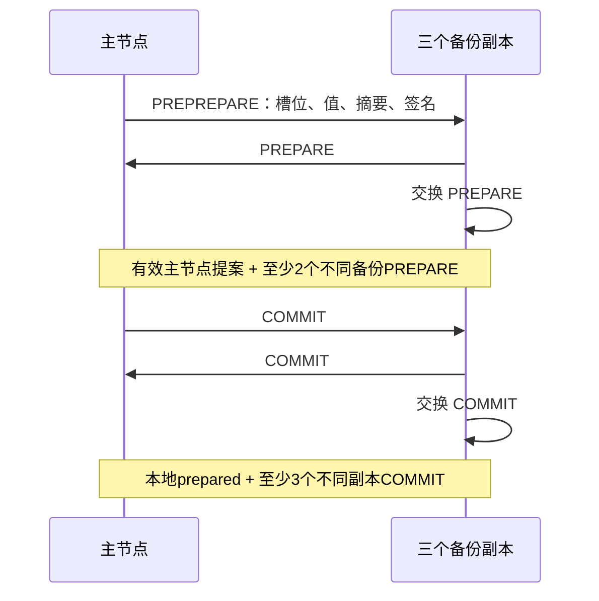
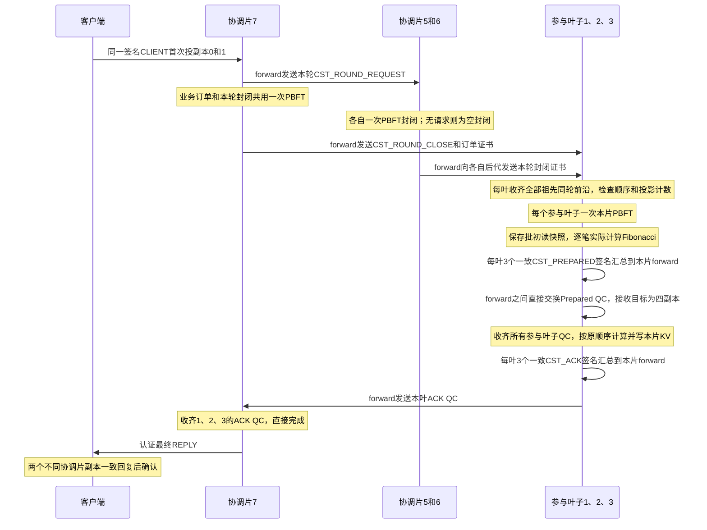

# Arbor 当前版本实现思路与流程审阅

核对日期：2026-10-03。依据当前工作树的 `source/main.cpp`、`source/network.h`、`source/state_digest.h`、`scripts/cluster.py` 和 `scripts/benchmark.py` 逐项核对。本文最初的流程审阅仅更新文档；本轮随后集成了第 10.2 节的本地跨片批次选择缓存，协议和配置保持原有行为。

**当前业务主线：客户端把跨片请求交给最近公共祖先协调片；协调片 PBFT 排序；实际参与叶子分别 PBFT 确定本片位置；叶子 forward 汇总准备证明并交换；叶子收齐依赖后执行、写入本片状态；协调片收齐所有参与叶子的完成证明后直接回复客户端。**

多协调片拓扑另外采用认证轮次封闭，让叶子在执行前确认同轮祖先订单已经完整确定。叶子仍逐批处理，没有推测执行、流水线、多版本状态或重做路径。协调片最多提前排序 8 个未完成业务批次，与叶子流水线是两种不同机制。

本文用三层、三方交易作为主要例子，并在第 14 节列出需要重点审阅的选择。历史阶段文档用于了解演进；当前行为以本文与源码为准。多层机制的补充说明见 [MULTILAYER_DESIGN.md](MULTILAYER_DESIGN.md)。

## 1. 部署、角色和交易归属

### 1.1 拓扑例子

```text
                 7
             /       \
            5         6
           / \       / \
          1   2     3   4
```

每个数字是一整个分片，每片运行 4 个独立副本进程。本例有 7 个分片、28 个副本进程。

| 角色 | 当前职责 |
|---|---|
| 叶子分片 1、2、3、4 | 保存各自 KV；片内交易排序、执行；跨片订单纳入本片顺序、准备依赖、执行和确认 |
| 协调分片 5、6、7 | 为自己的跨片请求 PBFT 排序；认证自己的轮次封闭；验证参与叶子的完成证明 |
| PBFT primary | 本片当前视图中唯一的新提案发起者，副本编号为 `view % 4` |
| forward | 与 primary 为同一个副本；收齐本片一致签名后转发跨片证明 |
| 客户端 | 生成并签名请求、按交易数限速、重试、收集一致回复、统计性能 |

协调片不保存参与叶子的业务 KV，不执行叶子的模拟交易程序。每个副本有自己的私钥、投票记录和状态，签名、PBFT 和执行均实际运行。

### 1.2 最近公共祖先 NCA

| 一笔交易的参与叶子 | NCA | 业务共识与执行涉及的分片 |
|---|---:|---|
| 1、2 | 5 | 协调片 5 排序，叶子 1、2 执行 |
| 3、4 | 6 | 协调片 6 排序，叶子 3、4 执行 |
| 1、3 | 7 | 协调片 7 排序，叶子 1、3 执行 |
| 1、2、3 | 7 | 协调片 7 排序，叶子 1、2、3 执行 |

一笔访问 1、2、3 的交易直接由 7 下发到这些叶子。5、6 不再为该笔祖先订单做一次业务排序；它们在多层控制路径中认证自己的轮次封闭。

树用于计算 NCA、祖先和后代集合。TCP 消息直接从源分片发到目标分片，不要求沿树逐跳中继。

## 2. 交易、请求、共识批次的区别

这三种单位需要分别看：

1. **交易**：一笔业务操作，有 `tx.id`、参与叶子和访问输入。
2. **客户端请求**：一个签名 CLIENT 包，包含请求 ID 和若干笔交易。`load --batch 10` 表示每个 CLIENT 包 10 笔。
3. **跨片共识批次**：协调片把兼容的完整 CLIENT 包合并后排序。`cross_shard_batch_size=100` 表示一个业务批次最多 100 笔交易。

例如 4000 笔交易、`--batch 10` 会生成 400 个请求；当同组请求充分到达，跨片批量上限为 100 时，可以将 10 个请求合为一批，共形成 40 个业务批次。客户端请求的签名内容始终完整保留，不拆包补齐批量。

| 标识 | 用途 |
|---|---|
| `run_id` | 隔离不同实验的消息、成员公钥和密钥 |
| `request.id` | 请求重试、请求内容冲突检测、请求结果查找 |
| `tx.id` + 完整交易摘要 | 相应交易路径中的交易去重与内容冲突检测 |
| `shard / view / seq / value_digest` | 绑定本片 PBFT 提案及投票 |
| `batch_key = NCA_ID:NCA_PBFT_seq` | 关联原始订单、准备证明、执行 witness 和完成证明 |
| `cst_order_index` | 一个协调片累计排序的业务批次数，空封闭不增加 |
| `cst_round` | 多协调片模式的封闭轮次 |
| `cst_watermarks[leaf]` | 一个协调片累计排序且涉及该叶子的业务批次数 |

`batch_key` 中的 NCA 不一定是全树根。PBFT seq、业务批次编号、轮次和每叶投影计数不是同一个数字。

## 3. 读写输入和模拟执行模型

三方交易示例：

```json
{
  "id": "example:tx:0",
  "participants": [1, 2, 3],
  "key": "account:1:17",
  "value": 10,
  "accesses": [
    {"shard": 1, "key": "account:1:17", "value": 10},
    {"shard": 2, "key": "account:2:83", "value": 20},
    {"shard": 3, "key": "account:3:9", "value": 30}
  ]
}
```

客户端声明参与者、key 和输入 value。**真实旧值与版本由叶子在本片订单共识完成后从自己的 KV 取得，客户端不提供可信旧值。**

当前每笔跨片交易在每个参与叶子访问一个 key，该 key 同时用于读取和写入。这是确定性合成程序，尚未提供任意多 key 合约、动态读写集提取或独立读写访问模式。顶层 `key/value` 是统一格式字段，跨片计算以 `accesses` 为准。

默认负载生成器在每个参与叶子分别随机选 `account:{shard}:{0..999}`，输入值为 1–999999；`--seed` 固定随机序列。跨片 key 属于不同叶子的独立 KV，不能把两个分片里相似的 key 名称理解成同一账户。

片内交易共识后真实计算 Fibonacci，将输入 value 写入本片 key，版本加一，并更新摘要。跨片交易的最终 value 还包含远片依赖，具体规则见第 8 节。

## 4. 客户端投递、验证与合批

### 4.1 首次投递与结果确认

首次向目标分片的副本 0、1 各发送同一签名请求，即 `f+1=2` 个不同副本。备份首次收到有效请求时转发给当前主节点；同请求重复到达不会反复走正常转发路径。

尚未确认时，客户端按约 0.5、1、2、4 秒的退避间隔重发，重试目标扩大为全部四副本。重传保持原请求内容和签名。

客户端收到目标分片两个不同副本对同一请求、同一结果的有效签名回复后才确认完成。跨片目标是该请求的 NCA；协调片仅排序成功时不会提前给客户端最终执行成功。

### 4.2 当前合批规则

协调片主节点按等待请求选择批次，保留每个完整签名 CLIENT 包：

- 一个请求内部各交易参与集合相同，则按规范化的参与集合分组。例如 `[3,1,2]` 和 `[1,2,3]` 属于同组。
- 不同请求只有组相同才能合批。访问不同 key 的请求仍可以合批。
- 一个请求内部混有不同参与集合时，所有交易仍须具有同一 NCA；该请求用 `mixed:request_id` 单独分组，不再与其他请求拼批。
- 同批不能重复选入同一个交易 ID，内容冲突会被拒绝。
- 总交易数不超过 `cross_shard_batch_size`。

**这里没有按“精确读写 key 集合相同”重新分类或调整交易顺序。** 已实现的是参与集合合批、批内同 key 读快照复用，以及按批交换依赖。存在相同 key 的多笔交易仍逐笔执行。

### 4.3 不满批也可以发起共识

提案先满足 `batch_wait_ms` 基础等待。跨片批次达到上限、下一个完整同组请求放不下、下一请求切换参与组，或者 `cross_shard_batch_wait_ms` 到期时，可以提交当前批次。

例如上限 64、每请求 10 笔，有七个同组请求时可先发 60 笔，最后 10 笔按尾批等待处理。不会一直等待无法由完整请求拼出的 64 笔。

## 5. 本片 PBFT 怎样运行

固定 `n=4、f=1`，每个分片使用同一套 PBFT 实现：



主节点不发 PREPARE。准备阈值是两个不同备份；提交阈值是三个不同副本，自身 COMMIT 可计入。每个副本独立验证签名、成员、run、槽位、摘要、请求和业务约束，投票按 signer 去重。

正常新提案只使用 `applied+1`；该槽已有提案时不再提出另一批。接收水位为 `stableSeq+64`，用于限制和恢复序号范围，**不是 64 批并行执行**。视图切换恢复时可能保留多个历史槽。

必须区分：

| 状态 | 含义 |
|---|---|
| PBFT `prepared` | 本片接受了认证提案并收齐准备票 |
| PBFT `committed_local` | 本片确定此槽及其内容 |
| 叶子业务 `staged` | 此跨片槽已共识，正在准备或等待依赖 |
| 叶子 `applied` 推进 | 已收齐依赖、完成执行并更新正式状态 |
| NCA 业务完成 | 所有实际参与叶子的 ACK QC 已到齐 |
| 客户端确认 | 两个目标副本的最终匹配回复已到齐 |

业务消息 `CST_PREPARED` 是读写记录证明，不是 PBFT 的 PREPARE 票。

## 6. 三层、三方跨片的完整正常流程

例子：一批交易全部访问叶子 1、2、3，NCA 为 7。图中每个分片端点代表它的四个副本；“叶子”代表三个实际参与叶子。



详细步骤：

1. **NCA 排序。** 7 的主节点合批，四副本实际运行 PBFT，保存确定性的业务订单、业务编号、轮次和投影水位。此时只确定了订单，尚未完成叶子执行。
2. **封闭本轮。** 5、6 有自己的请求时排序自己的业务；没有请求则 PBFT 认证 `requests=[]`。轮次协议向所有协调片提出需求，但每个叶子只要求自己的严格祖先证明。
3. **下发证书。** 7 的 forward 将封闭证书发给 1、2、3、4；5 发给 1、2；6 发给 3、4。参与业务的叶子缓存订单；其他后代缓存本轮封闭信息，不为该业务执行交易。
4. **叶子本片排序。** 1、2 要有 5 和 7 的同轮证书；3 要有 6 和 7 的同轮证书。检查通过后，各叶主节点分别提出一个包含原 NCA 订单的本片 PBFT 值。
5. **叶子准备。** 本片 PBFT committed 后，每副本生成本片读快照和逐笔准备记录，并发送自己的 `CST_PREPARED` 签名给本片 forward。正式 KV 与 applied 尚不推进。
6. **聚合并交换。** 每叶 forward 收三个不同副本的一致准备签名，形成一个 Prepared QC；片内分享，并发送给另外两个参与叶子。
7. **完成本片执行。** 每个叶副本收齐 1、2、3 的 Prepared QC，验证并按原交易顺序计算，更新自己的正式 KV，在原 PBFT 槽推进 applied，写提交日志。
8. **叶子完成证明。** 每副本发送 ACK 给本片 forward；forward 收三个一致 ACK 后形成 ACK QC，片内分享并发送给原 NCA 7。
9. **NCA 结束。** 7 的任意副本收齐实际参与叶子 1、2、3 的有效 ACK QC、确认执行上下文一致后，直接生成结果、释放在途业务额度并回复客户端。
10. **客户端结束。** 两个不同 7 副本的相同最终回复到齐，客户端计为完成。

第 9 步不再共识，之后没有上层 DECISION、叶子 FINALIZE、READY 或 DONE 阶段。源码函数 `finalizeCst()` 是第 7 步执行函数的名称，不代表新增共识阶段。

每次正常跨片发送由源片当前 forward 发起，接收端是目标片四副本。Prepared/ACK 先在本片收三票；接收者独立验证内部 QC，只有本片主节点能提出新 PBFT。

## 7. 多层轮次、水位与顺序控制

### 7.1 为什么需要额外证明

叶子可能同时收到不同祖先的订单。例如 5 有访问 1、2 的订单 A，7 有访问 1、3 的订单 B。它们都涉及 1，但消息到达顺序可能不同。

仅排列已经收到的订单，无法证明“另一祖先本轮没有更早订单”。当前用祖先封闭证书证明本轮输入已完整确定，再让所有叶子采用固定顺序。

`multiLayer()` 的源码判定是“非叶协调片数量大于 1”。只有一个协调片的两层树直接用 `CST_ORDER`，无需轮次控制。多协调片模式按需开启轮次，空闲时不持续制造空共识。

### 7.2 每个协调片怎样封闭一轮

一轮中，一个协调片最多认证一个封闭值：可以带一个业务批次，也可以是空封闭。封闭值为：

```json
{
  "requests": [],
  "cst_round": 3,
  "cst_watermarks": {"1": 2, "2": 1, "3": 0, "4": 0}
}
```

有业务的值还携带 `cst_order_index`。水位覆盖本协调片所有后代叶子；该批涉及某叶子时，这个叶子的计数加一，空封闭保持计数。这里统计批次，不统计交易数。

例如 7 第 1 批访问 1、3，第 2 批只访问 2、4，第 3 批访问 1、3。叶子 1 的投影计数是 1、2，不需要等待本来就不访问它的第 2 批。单靠协调片 PBFT seq 连续性无法处理这种情况。

### 7.3 叶子接受候选订单的条件

叶子提案携带 `cst_orders=[原订单证书]` 和 `cst_frontier=[所有祖先同轮封闭证书]`。备份独立校验：

1. 祖先集合完整、没有重复，全部证书属于同一正整数轮次。
2. 原提案、PREPARE、COMMIT 签名合法；候选业务确实涉及本叶子。
3. 每祖先水位与本片 `cst_indices[origin]` 相符；本轮有一个未完成的适用订单时，只能比本片已完成计数大一。
4. 已完成批次的摘要与历史记录相符，轮次不得回退。
5. 本轮未完成适用订单中，候选必须来自数值 ID 最小的协调片。候选整体按 `(round, coordinator_id)` 升序选择。

因此签名 PBFT 值本身包含顺序证据，不能只信主节点声称“已经收齐”。数字 ID 比较不是字符串比较。

同轮例子：5 封闭 A，7 封闭 B，6 为空。叶子 1 先执行 A，再执行 B；叶子 2 只执行 A；叶子 3 只执行 B，可先准备 B 等待 1。A 完成后 1 进入 B，依赖到齐即可结束 B。

没有参与业务的叶子不为纯空封闭再做一个本地空 PBFT。叶子可以跳过不涉及自己的历史轮次；累计投影计数会暴露漏掉的相关订单，缺口补取后才可执行后序订单。

### 7.4 与论文描述的对应

本实现保留论文第 V 节的 NCA 排序、参与叶子排序执行、依赖交换和 ACK 完成主线。第 V-B 节描述的“发现顺序分歧后，以最小叶子 ID 的顺序调整、重发读写集”尚未实现。

当前选择是先取得祖先同轮封闭证明，再按固定的协调片 ID 顺序执行，没有事后重排或重做。实验解释应明确采用这一顺序机制，不能把测量结果直接描述为已经复现第 V-B 节的重排流程。

### 7.5 真实共识成本

单协调片、p 个参与叶子的正常业务需要 `1+p` 次分片 PBFT。

在本例中，只有 7 有三方业务、5 和 6 为空时，一轮有 7 的业务封闭、5 和 6 的空封闭、1/2/3 的本地业务槽，共 **6 次分片 PBFT**。其中 2 次为空控制槽。叶子 4 不执行业务 PBFT。

最近 100/10 的 4000 笔测试形成 40 个业务批次，各轮合计 240 次分片 PBFT，包含 80 次空封闭；该计数来自实测日志，不是对所有负载固定套用的公式。

## 8. 准备记录、依赖证据与逐笔执行

### 8.1 准备记录保存什么

本片槽已 committed 后，每个叶副本产生：

```text
record = {
  shard, batch_key, order_digest, order_certificate,
  reads: {key: 批初本片账户状态},
  writes: [{id, tx_digest, key, value, fib, duplicate}]
}
```

每个本地非重复交易实际计算一次 Fibonacci；同 key 在本批只保存一份初始读快照。`writes` 此时记录输入、计算结果和重复标记，尚不是最终正式 KV 写值。

三个签名绑定相同的 `record_digest`，QC 为 `{record, votes}`。大 record 只保留一份，票保留各自 body/signature。

`record_digest` 绑定 `shard、batch_key、order_digest、reads、writes`，排除原订单证书中可变化的签名子集。原 ORDER 证书仍独立验证。否则同一正确订单的两种合法三签组合可能把准备票分成不同组。

### 8.2 完整 witness

收齐实际参与集合的所有 Prepared QC 后，按叶子数值 ID 排序组成：

```text
execution_witness = {batch_key, proofs: [{record, votes}, ...]}
```

验证要求 owners 恰好覆盖该业务批的参与叶子并集、批次和订单摘要一致、各证明有三个不同合法副本签名、同交易重复标记一致、访问输入和 Fibonacci 符合原订单。

远片旧状态的认证依据是源片三副本对记录的签名。接收者不独立查询远片实时 KV，也没有通用合约计算证明。业务 `execution_digest` 哈希确定性 records，不把签名子集变化混入执行身份。

### 8.3 执行规则

每副本从全部 records 的 reads 建立临时 working maps，按原订单中请求、交易的顺序逐笔计算。对当前这笔交易的实际参与集合 P：

```text
old_i = 本笔开始前，叶子 i 对应 key 的 working value
new_i = input_i + fib + sum(old_j, j属于P且j不等于i)  mod 2^64
```

先取所有 old，再计算所有 new，最后同时更新这一笔各参与者的 working 状态；下一笔读取更新后的值。`version` 加一，摘要绑定旧本地状态、按 owner 排序的远片旧状态、完整交易和 owner。

例如旧值为 10、20、30，输入都为 1，fib=1，三方新值分别为 52、42、32。两笔连续访问同一 key 时，第二笔会读到第一笔的结果，不会重复用批初值。

每副本为了还原跨片依赖会计算涉及的远片 working 状态，但仅将本片 working map 写回正式 KV，仅统计本片参与的新交易。Fibonacci 已在准备阶段实际计算，最终阶段使用已验证的 `expectedFib`，不再重复跑同一循环。

完整记录和 witness 在完成后仍保留，供落后副本与慢叶子补取。不能因本片完成就删除远片还可能需要的证据。

## 9. 提交与最终回复的边界

### 9.1 叶子同一槽内应用

跨片叶子槽已 PBFT committed，但依赖未齐时，正式 KV、该槽 applied 和业务状态摘要不推进。依赖齐全后，同一次应用处理中写本片 KV、记录 `cst_seen/cst_finalized/cst_batches`、推进投影计数与 applied、更新状态摘要，并写出带 witness 的提交日志。

该阶段未另开执行或提交 PBFT。日志 flush 不等于提供断电原子写入或投票 WAL 保证。

### 9.2 ACK QC 与 NCA 完成

每叶 ACK 绑定 `batch_key、target=NCA、order_digest、execution_digest、result_digest`。三个不同副本的 ACK 要一致，forward 才组成 QC。

NCA 逐叶验证并去重，仅将原业务参与者的有效完成证明计入完成条件。当前 ACK QC 接收分支没有单独显式过滤非参与叶子，最终完成判断只遍历真实参与集合。所有参与叶子必须绑定同一 ORDER 和同一 execution digest；各叶 result digest 可以不同，因为本片写入结果不同。

证明到齐后，NCA 按叶子 ID 汇总 result digests，生成每笔最终结果。完成缓存与 outstanding 释放是本地辅助操作；不追加共识，不把 QC 到达顺序或任意 signer 子集写入确定性业务状态。

### 9.3 可见性与失败语义

每叶在自身依赖齐全时独立写入，多个叶子的物理完成时刻可能不同。较快叶子应用完本批后可以继续本片工作；NCA 成功回复仍须等全部参与叶子的 ACK QC。

当前没有跨片统一读取屏障、超时 abort、取消或回滚。客户端超时只是没有在测量期限内收齐回复，不撤销已经排序或写入的交易。某叶永久不可用时，可能出现部分叶子已写入而客户端尚未确认的状态，需要恢复继续完成。

因此“全部 ACK 后才确认成功”不能等同于“所有片在同一物理时刻原子可见”。

## 10. 去重与状态保存

### 10.1 去重层次

| 层次 | 当前处理 |
|---|---|
| 请求 | 同 ID、同内容等待或返回已有结果；同 ID、不同内容拒绝 |
| 等待交易 | `pendingTx` 保存拥有请求；重叠请求进入 deferred，不同时重复提出 |
| 已完成交易 | 换请求 ID 重发已有交易时复用原结果；混合新旧请求保持签名，旧项不再改 KV |
| PBFT | 投票按 signer 去重，同槽重复提案不创建另一轮 |
| 跨片订单 | 按 batch key 与摘要去重，已完成订单重发可触发补发 ACK |
| QC / witness | 验证来源、阈值、批次和摘要；已验证完整证明可命中本地验证缓存 |

正常提交只释放相关交易索引，利用 `changedTx/deferredByTx` 唤醒受影响请求，不每完成一批就重建整个等待队列。完整索引重建用于检查点状态追赶。

**CLIENT 没有通用验签缓存。** 进入请求处理时会验签，在提案值校验时也会验证其中 CLIENT；重复包命中请求去重前仍有认证与内容检查。跨片证明验证缓存不能表述成客户端重复验签已经全部消除。

### 10.2 共识状态与辅助缓存分开

| 类型 | 例子 | 恢复方式 |
|---|---|---|
| 确定性业务状态 | KV、交易/请求去重记录、订单、投影计数、轮次元数据、叶子完成摘要 | 检查点与认证槽后缀 |
| 未完成本片执行上下文 | staged record、缺失依赖索引 | 原提交证书、存活副本与依赖查询 |
| 完整证明档案 | ORDER/round 证书、Prepared QC、execution witness、ACK QC | 本地保留与认证查询补取 |
| NCA 完成缓存 | `completedCstResults/completedTxResults/completedCstBatches` | 原订单和全部参与叶子 ACK QC 重建 |
| 下一跨片批次选择缓存 | `cstSelection`、脏标记与查询/重建计数 | 本地重算，不写入检查点或业务共识状态 |
| 运行统计与网络状态 | 超时、队列、连接、计数器 | 本地观测，不是业务共识输入 |

完成缓存和完整证明档案是内存辅助结构，不应因为它们存有签名，就认为已提供持久化恢复。交易去重和业务历史不能任意删掉，否则旧交易可能再次执行。

叶子 `nextCstOrder()` 缓存本地选择结果；新订单、待处理证书替换、祖先轮次证明新增、本片应用推进或检查点安装会使结果失效。重建仍进行原顺序和前沿验证，暂时无订单的结果同样可失效。主循环与提案共享这一结果，减少重复证书复制、序列化及哈希；不会恢复流水线，也不提供 CLIENT 通用验签缓存。状态中的 `cst_selection_lookups/rebuilds` 仅用于观察复用情况。

状态摘要按变化条目维护确定性 Merkle treap，检查点缓存冻结摘要。相同完整状态的摘要不依赖插入顺序，远端快照仍完整重建验证。KV 对外摘要仍在 KV 改变时全量 `hash(kv.dump())`；检查点也仍拷贝完整 state，长期历史增长的成本没有全部消除。

## 11. 网络、延时和 CPU

每个副本主要有两个线程：主线程维护 PBFT/跨片状态、验证和执行；网络线程使用非阻塞 TCP 与 `poll` 处理连接和发送定时队列。没有独立执行线程池。主线程每轮最多处理 256 条 inbox，再处理超时、提案和状态输出，最后休眠约 1 ms。

业务客户端与副本发送不再每消息建立 TCP。按目标 host/port 复用长连接，消息采用 4 字节长度前缀加 JSON 帧；连接失效后下一次发送重新连接，空闲连接有约 30 秒期限。Python 的 probe 工具投递控制包仍使用短连接，不是正常交易路径。

配置延时在**发送端排入定时队列**：`due = enqueue_time + configured_delay`，到期后才写 socket。主线程不会为每条消息 sleep。网络等待不足 1 ms 时向上取整为阻塞 poll，上限 10 ms，新任务通过 wake 管道唤醒，避免之前 `poll(...,0)` 忙等。

| 通信 | 延时查找 |
|---|---|
| 同片不同副本 | `intra_shard_delay_ms` |
| 不同分片 | 分片对 `shard_links`，未配置则默认跨片延时 |
| 同进程给自己 | 直接进入 inbox，没有网络延时 |
| 客户端请求/回复 | 当前未加分片间人工延时，仍有真实发送及调度开销 |

例如 7 直接发给 1，只查 `7↔1`，不把 `7↔5` 与 `5↔1` 相加。分片对配置对称的单向附加延时，一来一回通常两次计入。配置值是人工等待，实际到达时间还包含序列化、CPU、socket 和排队耗时。

当前没有带宽、随机丢包、抖动模型，也不是亚毫秒精确定时器。网络有单帧、总发送缓存、单目标缓存及连接数量上限，超限会记录 failure；后续协议重试仍可能补回。

28 个副本进程共享一台 8 核机器。签名验证、完整证书 JSON、Fibonacci、日志与检查点会竞争 CPU；增加分片不代表增加可用物理算力。大批量减少固定批次次数，同时增大单批验证、序列化和执行量。

## 12. 等待、重试与故障恢复

### 12.1 正常阻塞点

| 位置 | 等待条件 |
|---|---|
| 客户端 | 限速发送，或两个一致最终回复 |
| 协调片组批 | 基础等待、兼容请求和跨片合批阈值 |
| 协调片业务流量 | 当前最多 8 个尚未完成的业务 ORDER，满额后暂停新业务排序 |
| 多层叶子 | 所有祖先同轮封闭证明、前序投影订单 |
| 叶子 PBFT | 本片准备票与提交票 |
| 叶子执行 | 所有参与叶子 Prepared QC |
| NCA 完成 | 所有实际参与叶子 ACK QC |

叶子最多一个新批次在途，依赖等待时**整片后续业务等待**，包括不冲突 key 的片内交易。已经收到的后续订单可缓存，但没有提前执行。

协调片已排序槽可以继续推进到下一槽，不必每批都等叶子 ACK；8 是未完成业务窗口。多层流控时仍可做空封闭，让其他分支获得前沿。

### 12.2 证据重发与补取

PBFT 当前槽和 forward 心跳约每 250 ms 重发检查。跨片缺失依赖、未完成 ORDER/ACK 和轮次证明约每 2 秒补取或重发，正常完成后不持续全量广播历史 ACK。

| 查询 | 功能 |
|---|---|
| `CST_DEPENDENCY_QUERY/PROOFS` | 补取实际参与片的准备 QC / witness |
| `CST_RESULT_QUERY/PROOFS` | NCA 从本片同伴补取原 ORDER 与完成证明，恢复结果缓存 |
| `CST_ROUND_QUERY/PROOFS` | 补取祖先封闭证书，以及 `after_index` 后缺失的适用订单 |
| `SYNC_REQUEST/SYNC` | 本片落后副本获取认证检查点与槽后缀、执行 witness |

轮次查询每次最多 32 项，未来推进目标限制在当前轮次加 64，后续请求继续追赶。查询按累计投影计数补最早缺口，避免只查询已知最新轮次而漏掉早期订单。

### 12.3 主节点与 forward 接替

`view_timeout_ms` 是无进展时视图切换的基础超时，不是每批执行时间或 TPS 限流参数。forward 与 primary 一起随 view 切换，已经取得的 QC 在片内分享，接替者可补取证据并继续转发。

已 committed 而等待远片依赖的槽，不单独按“PBFT 未提交”反复换 view。跨片工作期间 forward 心跳失效仍可触发故障检查。视图切换携带认证检查点、准备证据及已有提交证明；已提交值不改写，恢复后继续原执行等待。

尚未覆盖：forward 持续发合法心跳、同时扣留跨片数据，没有独立投诉或替换规则。静默离线接替测试不能证明这类活跃遗漏故障已经解决。

### 12.4 活副本追赶与持久化边界

每 `checkpoint_batches` 个已应用槽发一次 CHECKPOINT，收三个不同副本相同状态摘要后成为稳定检查点。落后活副本通过完整快照和认证后缀追赶，跨片后缀还要有 witness；仅有 ORDER/COMMIT 证书不能伪装执行已完成。

合法后序提案可暴露缺失前缀，设置 `catchupTarget`，无进展时触发同步；不要求先换 view。快照导入后缺失的轮次证书与 NCA 完成缓存由查询补回。

本版本禁止在有既有 `commits.jsonl` 的同一 run 节点目录直接重启，避免丢失投票状态后重复投票。日志不是 fsync 投票 WAL；同 run 崩溃重启、整片断电、所有证明丢失后的完整恢复尚未实现。启动新的 run 是新实验，不是接续旧账本。

## 13. 参数、性能口径与验证依据

### 13.1 最近测试配置与仓库默认配置分开

| 参数 | `config/three_layer.json` 解析后 | 最近三方 100/10 测试 |
|---|---:|---:|
| `batch_size` | 32 | 1000 |
| `batch_wait_ms` | 10 | 10 |
| `cross_shard_batch_size` | 32 | 100 |
| `cross_shard_batch_wait_ms` | 200 | 600 |
| `view_timeout_ms` | 2000 | 2000 |
| `checkpoint_batches` | 16 | 16 |
| `fib_iterations` | 10000 | 1 |
| `intra_shard_delay_ms` | 1 | 1 |
| `default_inter_shard_delay_ms` | 50 | 20 |
| 客户端请求交易数 | load 未指定时按批量上限生成 | 10 |

最近的 100/10 是隔离实验配置，没有把仓库所有配置默认值改成 100。启动器对启动配置生成运行快照；运行中的 load 使用该快照，编辑原 JSON 后需启动新集群才生效。

测试配置与结果位于：

- [三方 100/10 测试报告](/Users/tanghaibo_office/Documents/ChatGPT/Arbor系统搭建/triple-cross-batch100-20261003-180505/REPORT.md)
- [该次实验配置](/Users/tanghaibo_office/Documents/ChatGPT/Arbor系统搭建/triple-cross-batch100-20261003-180505/config/three_layer_cross100.json)

### 13.2 TPS 和秒延时

`--rate` 是客户端计划注入率，按交易数而非请求数计算。例如每请求 10 笔、rate=1000，计划每 0.01 秒注入一个请求；注入率不是处理能力。`--timeout` 从整次 load 开始计算，包含发送阶段，不是全部发完后再开始计时。

客户端完成 TPS 为唯一 `executed` 交易数除以客户端本轮总运行耗时，含发送、排队、处理、确认与收尾。跨三片一笔仍计一笔，不能累加三个叶子的执行数作为系统 TPS。有限负载整轮 TPS 包含尾部等待，没有独立预热/稳态窗口。

一笔延时从其所属请求首次发送开始，到取得两个目标副本匹配最终回复为止；请求中的交易按同一次确认时刻逐笔记录。平均值和 p50/p95/p99 的单位全部为秒，取唯一已确认交易的 timings，未确认交易不进入这些统计。已确认的重复或错误结果也可能进入原始 timings；常规全部为新交易的性能测试均为执行完成样本，混合输入需结合各类别计数解读。

`incomplete=true` 表示测量期限内未全部确认，或者存在错误；它不等于服务器已经丢弃或回滚剩余交易。客户端 JSON 保存详细完成数、timings 和原 workload。未完整完成时终端不打印 TPS，但 JSON 仍保留计算出的 `completed_tps`，不能据此将该轮标为完整性能实验。

benchmark 另外检查分片四副本收敛、业务计数、未完成轮次、队列和网络缓存排空，并停止其独立测试节点；不改变默认 `runtime/latest`。

### 13.3 已有验证

本版多层代码此前完整 `make test` 112 项通过，覆盖 PBFT、客户端 f+1、去重、网络长连接与定时、摘要/快照、多层和多参与叶子、轮次缺口、forward 切换、追赶及执行结果核对。依据与复测指令见 [MULTILAYER_VALIDATION.md](MULTILAYER_VALIDATION.md) 和 [../TESTING.md](../TESTING.md)。这些是缓存优化前的验证记录；最初的文档审阅没有新增代码或重跑性能测试。

缓存优化前的 100/10 三方测试，每轮 4000 笔，发送率 500/1000/4000 各三轮；9 轮全部完成并收敛。对应 TPS 中位数为 397.77 / 399.52 / 367.02。这是指定 8 核机器、配置和有限负载的观测，不是保证值。

本轮选择缓存已集成到原工程，集成后完整回归 112 项、配置校验及差异格式检查通过。新二进制的两轮 4000 笔三方跨片交易均全部完成并收敛，但网络 failure 计数为 165/9，未列为网络零失败验收；时间线指向客户端结束后的迟到回复，完整逐消息归因仍有限制。实现、失效条件与验证详见 [PERFORMANCE_OPTIMIZATION.md](PERFORMANCE_OPTIMIZATION.md) 的多层批次选择缓存章节。

## 14. 建议重点审阅的设计选择

以下都是当前真实行为，便于判断下一轮是否需要调整。

| 审阅点 | 当前实现与影响 |
|---|---|
| 多层顺序机制 | 所有协调片按需参与轮次封闭，叶子等待自己的全部祖先；保证输入完整需要额外空 PBFT。第 V-B 节的事后重排尚未实现 |
| 叶子并发范围 | 单新批次、整片等待；无关 key 也等待。这延续了移除流水线后的要求 |
| 完成协议 | NCA 收齐参与叶子 ACK QC 就结束，上层没有完成 PBFT；同时没有 abort 与跨片统一可见性屏障 |
| forward 的通信范围 | 源片只由当前 forward 出片，目标四副本独立收证书；减少源重复广播，但目标仍有四份接收、验证成本 |
| 合批方式 | 按相同参与集合拼完整请求，同 key 读快照复用；没有精确读写集重排或并行冲突调度 |
| 片内/跨片公平性 | 叶子先选 `pending` 片内 CLIENT，只有该批为空才选 `pendingCst`；持续片内流量可能压住跨片，没有公平配额或轮转 |
| 请求选择顺序 | `pending` 是 `std::map<string,...>`，按请求 ID 字典序选择，不是到达顺序；例如 request:100 可能排在 request:20 前，影响尾延时 |
| 重复认证成本 | 请求去重前仍要认证；提案校验再验 CLIENT。跨片完整证明有缓存，CLIENT 没有通用验签缓存 |
| 大证书开销 | 叶子 PBFT 值的 `cst_orders` 和 `cst_frontier` 含重复原订单证书；验签缓存能减少部分验证，不能消除重复序列化、哈希和传输 |
| 历史状态增长 | 增量业务摘要和检查点摘要缓存保留；KV 摘要全量扫描、完整检查点拷贝、历史证明与去重记录增长仍有成本。叶子轮次缓存达到 100000 项后拒绝新的轮次，尚无历史归档机制 |
| 故障模型 | 可处理测试覆盖的静默离线与活副本追赶；心跳下持续扣留数据、永久失效参与片、整片断电恢复仍有进展缺口 |

此前关注的第 1、2、4、6 项工程优化继续保留：客户端首次投两个副本及请求去重、增量等待索引、增量状态摘要与检查点摘要缓存、阻塞网络定时等待；TCP 长连接与 forward 三签汇总也保留。第 5 项公平队列调度尚未实现。文档不把计划中的优化记为已有能力。

此外，论文的状态重分区、运行时状态迁移、自适应拓扑扩缩容及 SharPer 对照方案尚未在当前实现中提供。

## 15. 代码定位与运行文件

下表按函数名定位当前实现，避免工程优化造成行号变化。

| 文件和位置 | 对应流程 |
|---|---|
| [`main.cpp`](../source/main.cpp)，`Membership`、`lca`、`multiLayer`、`delay` | 拓扑、角色、延时查表 |
| `main.cpp`，`isForward/sendShard` | 源 forward 和目标四副本投递 |
| `main.cpp`，`validRequestForShard`、`participantGroup`、`propose` | 输入检查、参与集合分组和组批 |
| `main.cpp`，`validLeafOrder`、`nextCstOrder`、`requestRound/rememberRound/queryRounds` | 多层顺序、前沿、水位、轮次补取 |
| `main.cpp`，`acceptProposal/advance` | PBFT 接收、PREPARE/COMMIT 推进 |
| `main.cpp`，`forwardCstOrder`、`stageCst`、`forwardPrepared` | 排序证书下发、读快照和准备 QC |
| `main.cpp`，`recordPayload`、`validExecutionWitness`、`finalizeCst`、`applyReady` | 证明身份、确定性执行与同槽应用 |
| `main.cpp`，`sendAck/forwardAck`、`maybeCompleteBatch` | 叶子 ACK 与 NCA 直接结束 |
| `main.cpp`，`drainDeferred`、`refreshDigests` | 增量去重维护与状态摘要 |
| `main.cpp`，`installStable/acceptNewView`、`handle(SYNC)`、`Replica::run` | 检查点、换 view、追赶与重试 |
| `main.cpp`，`client` | f+1 首发、限速、最终确认、TPS 和秒延时 |
| [`network.h`](../source/network.h)，`networkPollTimeout`、`openTask`、`loop`、`send` | 阻塞计时、长连接、非阻塞 I/O 和发送预算 |
| [`state_digest.h`](../source/state_digest.h)，`StateDigest` | 确定性增量业务状态摘要 |
| [`cluster.py`](../scripts/cluster.py)，`validate`、`prepare_workload`、`load` | 配置校验、工作负载和用户入口 |

可编辑配置统一放 `config/`，分片运行目录在 `runtime/` 等独立 run 目录。`accessControlList/networkConfig/shardsTopology/workloadProfile` 为旧格式参考，新启动器读取 JSON。节点 `status.json` 提供 applied、staged/finalized、轮次、投影计数、view、队列和网络指标；`events.jsonl` 可观察 `committed_local/cst_staged/cst_executed/cst_complete/sync_requested`；`commits.jsonl` 保存槽证书与执行 witness。

`make clean` 停止工程内登记节点并清理编译、运行和测试产物，保留源码与编辑配置；工程外另存的报告不随之删除。检测到仍在运行的负载、benchmark 或测试脚本时会阻止清理。

本次核对 `source/main.cpp` SHA-256：`e25a2f3bcb2666a573a3b6c2a2f76c8e162a10d2289a626e9a204e976ad813b5`。
